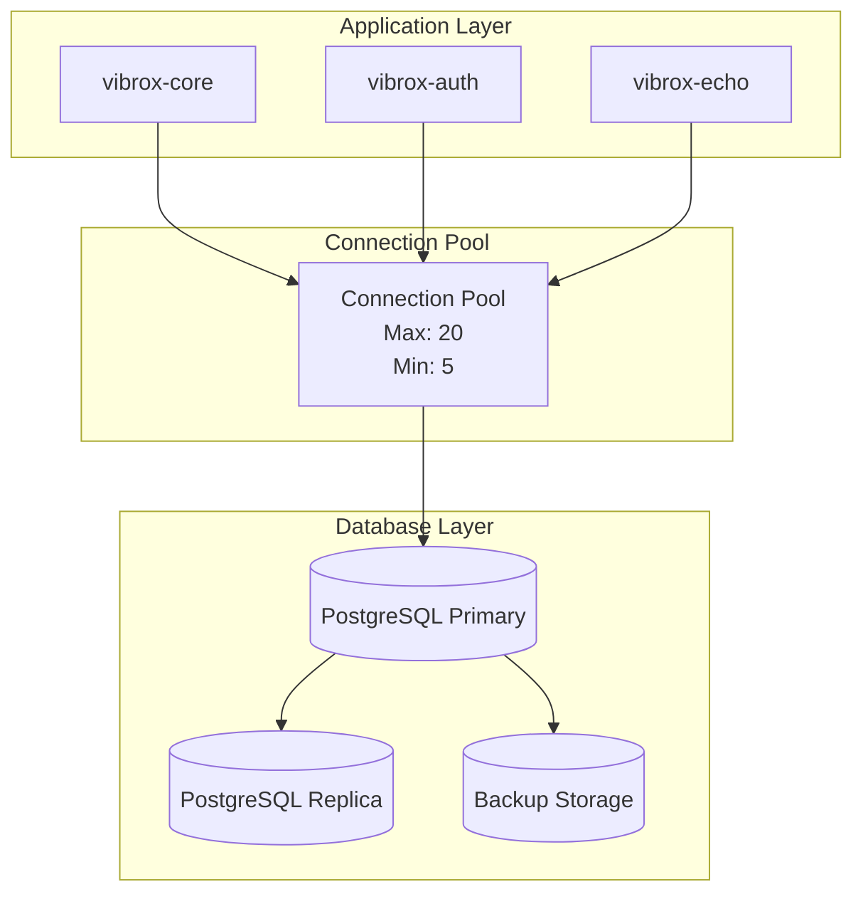

# ADR-0003: Database Strategy

## Status

Accepted

## Context

The Vibrox Stack requires a reliable, scalable database solution to store:
- User data and profiles
- Authentication information
- Application state
- Audit logs and metadata

We need to choose a database technology that supports:
- ACID transactions
- Complex queries and relationships
- High availability and scalability
- Data consistency across microservices
- Backup and recovery capabilities

## Decision

We will use **PostgreSQL** as the primary database for the Vibrox Stack.

### Rationale

#### PostgreSQL Advantages

**Reliability & ACID Compliance:**
- Full ACID transaction support
- Data integrity and consistency guarantees
- Robust error handling and recovery mechanisms
- Mature and battle-tested in production environments

**Performance & Scalability:**
- Excellent performance for complex queries
- Advanced indexing capabilities (B-tree, Hash, GIN, GiST)
- Query optimization and execution planning
- Support for read replicas and horizontal scaling

**Data Types & Features:**
- Rich set of data types (JSON, JSONB, Arrays, UUID, etc.)
- Full-text search capabilities
- Geographic data support (PostGIS extension)
- Advanced features like triggers, stored procedures, and views

**Ecosystem & Tooling:**
- Extensive ecosystem of tools and libraries
- Excellent monitoring and administration tools
- Strong community support and documentation
- Native support in Go (lib/pq, pgx) and Node.js (pg, sequelize)

**Operational Excellence:**
- Easy backup and restore procedures
- Point-in-time recovery capabilities
- Built-in replication and clustering support
- Comprehensive logging and monitoring

## Consequences

### Positive

1. **Data Integrity**: ACID compliance ensures data consistency
2. **Performance**: Optimized for complex queries and relationships
3. **Flexibility**: Rich data types support various use cases
4. **Scalability**: Horizontal and vertical scaling capabilities
5. **Ecosystem**: Mature tooling and community support
6. **Cost-Effective**: Open-source with no licensing costs

### Negative

1. **Complexity**: More complex setup and administration compared to NoSQL
2. **Learning Curve**: Team needs PostgreSQL expertise
3. **Resource Usage**: Higher memory and storage requirements
4. **Scaling Challenges**: Horizontal scaling requires additional setup

### Risks

1. **Single Point of Failure**: Database becomes a critical dependency
2. **Performance Bottlenecks**: Complex queries can impact performance
3. **Data Migration**: Schema changes require careful planning
4. **Backup Complexity**: Point-in-time recovery requires proper configuration

## Implementation

### Database Schema

```sql
-- Users table
CREATE TABLE users (
    id SERIAL PRIMARY KEY,
    name VARCHAR(255) NOT NULL,
    email VARCHAR(255) UNIQUE NOT NULL,
    created_at TIMESTAMP DEFAULT CURRENT_TIMESTAMP,
    updated_at TIMESTAMP DEFAULT CURRENT_TIMESTAMP
);

-- User authentication table
CREATE TABLE user_auth (
    id SERIAL PRIMARY KEY,
    user_id INTEGER REFERENCES users(id) ON DELETE CASCADE,
    password_hash VARCHAR(255) NOT NULL,
    created_at TIMESTAMP DEFAULT CURRENT_TIMESTAMP
);

-- Audit logs table
CREATE TABLE audit_logs (
    id SERIAL PRIMARY KEY,
    user_id INTEGER REFERENCES users(id),
    action VARCHAR(100) NOT NULL,
    resource_type VARCHAR(100),
    resource_id INTEGER,
    metadata JSONB,
    created_at TIMESTAMP DEFAULT CURRENT_TIMESTAMP
);

-- Indexes for performance
CREATE INDEX idx_users_email ON users(email);
CREATE INDEX idx_user_auth_user_id ON user_auth(user_id);
CREATE INDEX idx_audit_logs_user_id ON audit_logs(user_id);
CREATE INDEX idx_audit_logs_created_at ON audit_logs(created_at);
CREATE INDEX idx_audit_logs_metadata ON audit_logs USING GIN(metadata);
```

### Connection Configuration

```yaml
# Database configuration
database:
  host: db
  port: 5432
  name: postgres
  user: postgres
  password: server
  ssl_mode: disable
  max_connections: 20
  connection_timeout: 30s
  idle_timeout: 300s
```

### Service Integration

#### Go Services (vibrox-core, vibrox-echo)
```go
import (
    "gorm.io/gorm"
    "gorm.io/driver/postgres"
)

dsn := "host=db user=postgres password=server dbname=postgres port=5432 sslmode=disable"
db, err := gorm.Open(postgres.Open(dsn), &gorm.Config{})
```

#### Node.js Service (vibrox-auth)
```javascript
const { Pool } = require('pg');

const pool = new Pool({
  host: 'db',
  port: 5432,
  database: 'postgres',
  user: 'postgres',
  password: 'server',
  max: 20,
  idleTimeoutMillis: 30000,
  connectionTimeoutMillis: 2000,
});
```

## Database Architecture



## Data Management Strategy

### Backup Strategy

1. **Automated Backups**: Daily full backups with WAL archiving
2. **Point-in-Time Recovery**: Continuous WAL archiving for PITR
3. **Cross-Region Replication**: Backup copies stored in different regions
4. **Testing**: Regular backup restoration testing

### Migration Strategy

1. **Version Control**: Database schema changes in version control
2. **Migration Tools**: Use tools like Flyway or custom migration scripts
3. **Rollback Plan**: Always maintain rollback capabilities
4. **Testing**: Test migrations in staging environment first

### Monitoring Strategy

1. **Performance Metrics**: Query performance, connection pool usage
2. **Health Checks**: Database connectivity and response time
3. **Alerting**: Proactive alerts for issues
4. **Logging**: Comprehensive database operation logging

## Alternatives Considered

### 1. MySQL

**Pros:**
- Widely used and well-documented
- Good performance for read-heavy workloads
- Simpler setup and administration

**Cons:**
- Less advanced features compared to PostgreSQL
- Limited JSON support
- Less robust for complex queries

### 2. MongoDB (NoSQL)

**Pros:**
- Schema flexibility
- Horizontal scaling
- JSON-native storage

**Cons:**
- No ACID compliance across documents
- Complex transactions
- Less mature ecosystem for our use case

### 3. CockroachDB

**Pros:**
- Distributed SQL database
- Built-in scalability
- PostgreSQL compatibility

**Cons:**
- Newer technology with less maturity
- Higher operational complexity
- Resource requirements

### 4. SQLite

**Pros:**
- Simple setup
- No server required
- Good for development

**Cons:**
- Limited concurrent access
- No network access
- Not suitable for production microservices

## Related Decisions

- [ADR-0001: Microservices Architecture](./0001-microservices-architecture.md)
- [ADR-0002: Service Communication Protocol](./service-communication.md)
- [ADR-0004: Deployment Strategy](./deployment-strategy.md)

## References

- [PostgreSQL Documentation](https://www.postgresql.org/docs/)
- [GORM Documentation](https://gorm.io/docs/)
- [Node.js pg Documentation](https://node-postgres.com/)
- [PostgreSQL Performance Tuning](https://www.postgresql.org/docs/current/runtime-config-query.html)

---

*This ADR should be reviewed when considering database technology changes, scaling strategies, or when adding new data storage requirements.*
