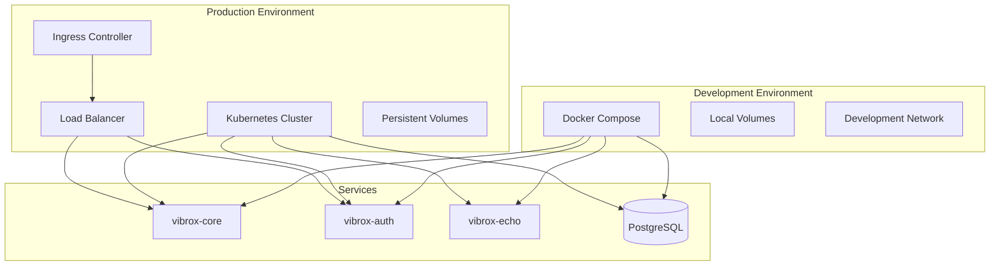
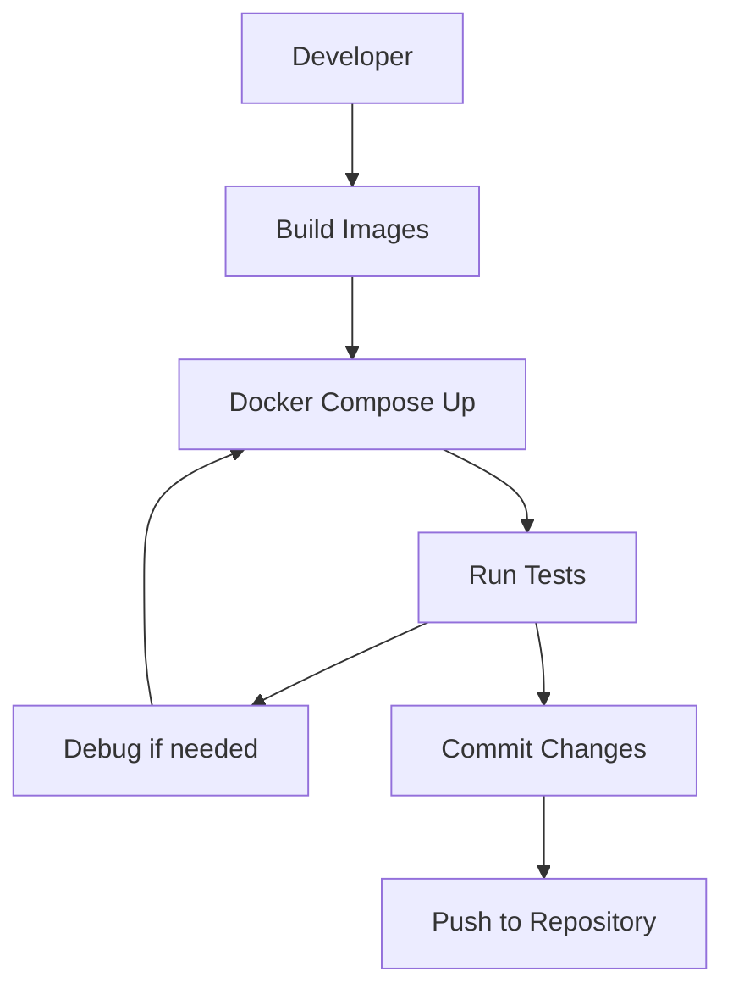
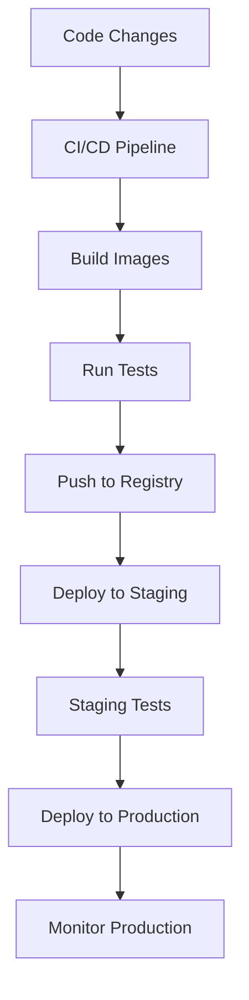

# ADR-0004: Deployment Strategy

## Status

Accepted

## Context

The Vibrox Stack consists of three microservices that need to be deployed across different environments:
- Development environment for local development
- Staging environment for testing
- Production environment for live services

We need to choose deployment strategies that provide:
- Consistent environments across development and production
- Easy local development setup
- Scalability and high availability in production
- Service discovery and load balancing
- Configuration management
- Monitoring and observability

## Decision

We will use:
- **Docker Compose for development and local testing**
- **Kubernetes for staging and production deployment**

### Rationale

#### Docker Compose for Development

**Advantages:**
- **Simplicity**: Easy to understand and use for developers
- **Local Development**: Fast iteration and debugging capabilities
- **Service Orchestration**: Automatic service discovery and networking
- **Volume Mounting**: Easy access to source code and logs
- **Environment Consistency**: Same container images across environments
- **Resource Efficiency**: Lower resource requirements for development

**Implementation:**
- Single `docker-compose.yml` file for all services
- Volume mounts for source code and persistent data
- Environment variables for configuration
- Health checks and dependency management

#### Kubernetes for Production

**Advantages:**
- **Scalability**: Horizontal and vertical scaling capabilities
- **High Availability**: Automatic failover and recovery
- **Service Discovery**: Built-in service discovery and load balancing
- **Configuration Management**: ConfigMaps and Secrets for configuration
- **Rolling Updates**: Zero-downtime deployments
- **Resource Management**: CPU and memory limits and requests
- **Monitoring**: Built-in monitoring and logging capabilities

**Implementation:**
- Kubernetes manifests for each service
- Persistent volume claims for data storage
- Ingress controllers for external access
- Horizontal Pod Autoscalers for automatic scaling

## Consequences

### Positive

1. **Developer Experience**: Simple local development with Docker Compose
2. **Production Readiness**: Enterprise-grade deployment with Kubernetes
3. **Environment Consistency**: Same container images across environments
4. **Scalability**: Kubernetes provides excellent scaling capabilities
5. **Operational Excellence**: Built-in monitoring, logging, and recovery
6. **Cost Efficiency**: Resource optimization in production

### Negative

1. **Complexity**: Kubernetes adds operational complexity
2. **Learning Curve**: Team needs Kubernetes expertise
3. **Resource Requirements**: Higher resource needs for Kubernetes
4. **Debugging**: More complex debugging in Kubernetes environment

### Risks

1. **Environment Drift**: Differences between development and production
2. **Kubernetes Complexity**: Operational overhead and maintenance
3. **Resource Management**: Proper resource allocation and monitoring
4. **Service Discovery**: Ensuring consistent service discovery across environments

## Implementation

### Docker Compose Configuration

```yaml
# docker-compose.yml
version: '3.8'

services:
  db:
    image: postgres:15
    ports:
      - "5432:5432"
    environment:
      - POSTGRES_USER=postgres
      - POSTGRES_PASSWORD=server
      - POSTGRES_DB=postgres
    networks:
      - app-network
    volumes:
      - vibrox-vol:/var/lib/postgresql/data

  logger:
    build: ./vibrox-echo
    ports:
      - "9000:9000"
    networks:
      - app-network
    volumes:
      - ./vibrox-echo/logs:/app/logs

  auth:
    build: ./vibrox-auth
    ports:
      - "8000:8000"
    environment:
      - DB_HOST=db
      - DB_USER=postgres
      - DB_PASSWORD=server
      - DB_NAME=postgres
      - LOGGER_HOST=logger:9000
    depends_on:
      - db
      - logger
    networks:
      - app-network

  app:
    build: ./vibrox-core
    ports:
      - "8080:8080"
    environment:
      - DB_HOST=db
      - DB_USER=postgres
      - DB_PASSWORD=server
      - DB_NAME=postgres
      - AUTH_HOST=auth:8000
      - LOGGER_HOST=logger:9000
    depends_on:
      - db
      - logger
      - auth
    networks:
      - app-network

networks:
  app-network:

volumes:
  vibrox-vol:
```

### Kubernetes Manifests

#### Database Deployment
```yaml
# manifests/db-deployment.yml
apiVersion: apps/v1
kind: Deployment
metadata:
  name: postgres
spec:
  replicas: 1
  selector:
    matchLabels:
      app: postgres
  template:
    metadata:
      labels:
        app: postgres
    spec:
      containers:
      - name: postgres
        image: postgres:15
        ports:
        - containerPort: 5432
        env:
        - name: POSTGRES_USER
          value: postgres
        - name: POSTGRES_PASSWORD
          valueFrom:
            secretKeyRef:
              name: db-secret
              key: password
        - name: POSTGRES_DB
          value: postgres
        volumeMounts:
        - name: postgres-storage
          mountPath: /var/lib/postgresql/data
      volumes:
      - name: postgres-storage
        persistentVolumeClaim:
          claimName: postgres-pvc
```

#### Service Deployment
```yaml
# manifests/app-deployment.yml
apiVersion: apps/v1
kind: Deployment
metadata:
  name: vibrox-core
spec:
  replicas: 3
  selector:
    matchLabels:
      app: vibrox-core
  template:
    metadata:
      labels:
        app: vibrox-core
    spec:
      containers:
      - name: vibrox-core
        image: vibrox-core:latest
        ports:
        - containerPort: 8080
        env:
        - name: DB_HOST
          value: postgres-service
        - name: DB_USER
          value: postgres
        - name: DB_PASSWORD
          valueFrom:
            secretKeyRef:
              name: db-secret
              key: password
        - name: DB_NAME
          value: postgres
        - name: AUTH_HOST
          value: vibrox-auth-service:8000
        - name: LOGGER_HOST
          value: vibrox-echo-service:9000
        resources:
          requests:
            memory: "128Mi"
            cpu: "100m"
          limits:
            memory: "256Mi"
            cpu: "200m"
        livenessProbe:
          httpGet:
            path: /health
            port: 8080
          initialDelaySeconds: 30
          periodSeconds: 10
        readinessProbe:
          httpGet:
            path: /health
            port: 8080
          initialDelaySeconds: 5
          periodSeconds: 5
```

## Deployment Architecture



## Deployment Workflow

### Development Workflow



### Production Workflow



## Configuration Management

### Environment Variables

```yaml
# Development (.env)
DB_HOST=db
DB_USER=postgres
DB_PASSWORD=server
DB_NAME=postgres
AUTH_HOST=auth:8000
LOGGER_HOST=logger:9000

# Production (Kubernetes ConfigMap)
apiVersion: v1
kind: ConfigMap
metadata:
  name: app-config
data:
  DB_HOST: postgres-service
  DB_USER: postgres
  DB_NAME: postgres
  AUTH_HOST: vibrox-auth-service:8000
  LOGGER_HOST: vibrox-echo-service:9000
```

### Secrets Management

```yaml
# Kubernetes Secret
apiVersion: v1
kind: Secret
metadata:
  name: db-secret
type: Opaque
data:
  password: c2VydmVy  # base64 encoded
```

## Monitoring and Observability

### Health Checks

```yaml
# Docker Compose health checks
healthcheck:
  test: ["CMD", "curl", "-f", "http://localhost:8080/health"]
  interval: 30s
  timeout: 10s
  retries: 3
  start_period: 40s

# Kubernetes probes
livenessProbe:
  httpGet:
    path: /health
    port: 8080
  initialDelaySeconds: 30
  periodSeconds: 10
readinessProbe:
  httpGet:
    path: /health
    port: 8080
  initialDelaySeconds: 5
  periodSeconds: 5
```

### Logging Strategy

```yaml
# Docker Compose logging
logging:
  driver: "json-file"
  options:
    max-size: "10m"
    max-file: "3"

# Kubernetes logging
spec:
  containers:
  - name: vibrox-core
    image: vibrox-core:latest
    # Logs automatically collected by Kubernetes
```

## Scaling Strategy

### Horizontal Scaling

```yaml
# Kubernetes Horizontal Pod Autoscaler
apiVersion: autoscaling/v2
kind: HorizontalPodAutoscaler
metadata:
  name: vibrox-core-hpa
spec:
  scaleTargetRef:
    apiVersion: apps/v1
    kind: Deployment
    name: vibrox-core
  minReplicas: 3
  maxReplicas: 10
  metrics:
  - type: Resource
    resource:
      name: cpu
      target:
        type: Utilization
        averageUtilization: 70
```

### Resource Management

```yaml
resources:
  requests:
    memory: "128Mi"
    cpu: "100m"
  limits:
    memory: "256Mi"
    cpu: "200m"
```

## Alternatives Considered

### 1. Docker Swarm

**Pros:**
- Native Docker orchestration
- Simpler than Kubernetes
- Good for smaller deployments

**Cons:**
- Less feature-rich than Kubernetes
- Smaller ecosystem
- Limited enterprise features

### 2. Nomad

**Pros:**
- Simple and lightweight
- Multi-datacenter support
- Good for mixed workloads

**Cons:**
- Smaller ecosystem
- Less Kubernetes integration
- Limited enterprise adoption

### 3. AWS ECS/Fargate

**Pros:**
- Managed service
- Good AWS integration
- Serverless option available

**Cons:**
- Vendor lock-in
- Higher costs
- Limited portability

### 4. Bare Metal Deployment

**Pros:**
- Maximum control
- No virtualization overhead
- Cost-effective for large scale

**Cons:**
- High operational complexity
- Manual scaling
- Limited automation

## Related Decisions

- [ADR-0001: Microservices Architecture](./0001-microservices-architecture.md)
- [ADR-0002: Service Communication Protocol](./service-communication.md)
- [ADR-0003: Database Strategy](./database-strategy.md)

## References

- [Docker Compose Documentation](https://docs.docker.com/compose/)
- [Kubernetes Documentation](https://kubernetes.io/docs/)
- [Docker Best Practices](https://docs.docker.com/develop/dev-best-practices/)
- [Kubernetes Production Best Practices](https://kubernetes.io/docs/concepts/configuration/overview/)

---

*This ADR should be reviewed when considering deployment technology changes, scaling strategies, or when adding new deployment environments.*
