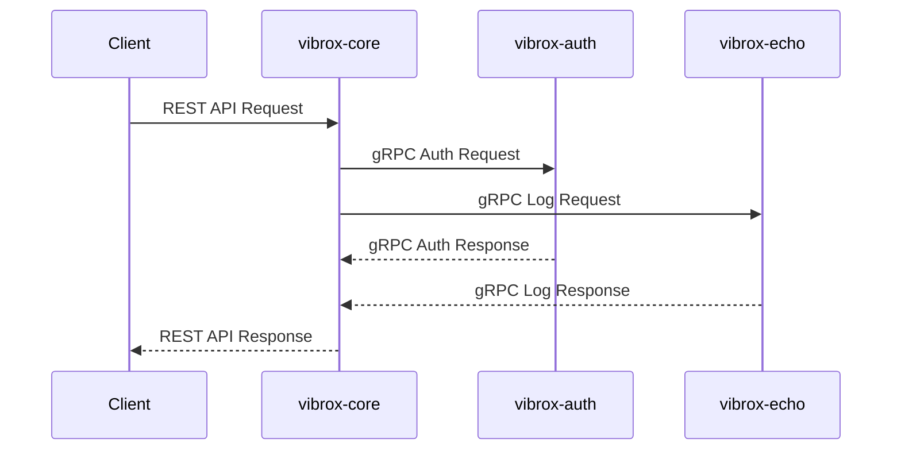

# ADR-0002: Service Communication Protocol

## Status

Accepted

## Context

The Vibrox Stack consists of three microservices that need to communicate with each other:

- `vibrox-core` (Go) - User management service
- `vibrox-auth` (Node.js) - Authentication service
- `vibrox-echo` (Go) - Logging service

We need to choose appropriate communication protocols for:

1. Inter-service communication (internal)
2. External API communication (client-facing)

## Decision

We will use:

- **gRPC for inter-service communication** (internal)
- **REST APIs for external client communication** (external)

### Rationale

#### gRPC for Inter-Service Communication

**Advantages:**

- **Performance**: Protocol Buffers are more efficient than JSON for serialization
- **Type Safety**: Strong typing with Protocol Buffer definitions
- **Bidirectional Streaming**: Support for streaming requests/responses
- **Code Generation**: Automatic client/server code generation
- **Language Agnostic**: Works well across Go and Node.js
- **Built-in Features**: Authentication, load balancing, health checking

**Implementation:**

- All internal service calls use gRPC
- Protocol Buffer definitions shared across services
- Automatic code generation for client/server stubs

#### REST APIs for External Communication

**Advantages:**

- **Widely Supported**: Universal support across all client platforms
- **Human Readable**: Easy to debug and test with tools like curl/Postman
- **Caching**: Standard HTTP caching mechanisms
- **Stateless**: Each request contains all necessary information
- **Documentation**: OpenAPI/Swagger support for API documentation

**Implementation:**

- `vibrox-core` exposes REST APIs for client applications
- Standard HTTP status codes and error handling
- JSON request/response format

## Consequences

### Positive

1. **Performance**: gRPC provides better performance for internal communication
2. **Developer Experience**: REST APIs are familiar and easy to work with
3. **Scalability**: Both protocols support horizontal scaling
4. **Monitoring**: Standard HTTP metrics for REST, gRPC metrics for internal calls
5. **Security**: gRPC supports TLS and authentication mechanisms

### Negative

1. **Complexity**: Need to maintain both gRPC and REST protocols
2. **Learning Curve**: Team needs to understand both protocols
3. **Debugging**: gRPC calls require specialized tools for debugging
4. **Documentation**: Need to maintain both Protocol Buffer and OpenAPI documentation

### Risks

1. **Protocol Mismatch**: Potential confusion between internal and external APIs
2. **Tooling**: Need appropriate tooling for both protocols
3. **Testing**: More complex testing setup for dual protocols

## Implementation

### gRPC Services

```protobuf
// Authentication Service
service AuthService {
  rpc Authenticate(AuthRequest) returns (AuthResponse);
  rpc ValidateToken(TokenRequest) returns (TokenResponse);
  rpc RefreshToken(RefreshRequest) returns (RefreshResponse);
  rpc Logout(LogoutRequest) returns (LogoutResponse);
}

// Logging Service
service LogService {
  rpc Log(LogRequest) returns (LogResponse);
  rpc GetLogs(GetLogsRequest) returns (GetLogsResponse);
  rpc SearchLogs(SearchLogsRequest) returns (SearchLogsResponse);
}
```

### REST API Endpoints

```http
# User Management
GET    /api/users
GET    /api/users/{id}
POST   /api/users
PUT    /api/users/{id}
DELETE /api/users/{id}

# Authentication
POST   /api/auth/login
POST   /api/auth/logout
POST   /api/auth/refresh

# Health Checks
GET    /health
GET    /status
```

### Service Communication Flow



## Alternatives Considered

### 1. REST for All Communication

**Pros:**

- Simpler architecture
- Universal tooling support
- Easier debugging

**Cons:**

- Lower performance for internal calls
- More verbose data serialization
- No streaming support

### 2. gRPC for All Communication

**Pros:**

- Maximum performance
- Consistent protocol across all communication
- Advanced features (streaming, etc.)

**Cons:**

- Limited client support (especially web browsers)
- More complex client implementation
- Steeper learning curve for external developers

### 3. GraphQL

**Pros:**

- Flexible querying
- Strong typing
- Single endpoint

**Cons:**

- Overkill for simple CRUD operations
- Additional complexity
- Limited streaming support

## Related Decisions

- [ADR-0001: Microservices Architecture](./0001-microservices-architecture.md)
- [ADR-0003: Database Strategy](./database-strategy.md)
- [ADR-0004: Deployment Strategy](./deployment-strategy.md)

## References

- [gRPC Documentation](https://grpc.io/docs/)
- [REST API Design Guidelines](https://restfulapi.net/)
- [Protocol Buffers Guide](https://developers.google.com/protocol-buffers)
- [OpenAPI Specification](https://swagger.io/specification/)

---

_This ADR should be reviewed when considering changes to service communication protocols or when adding new services to the stack._
