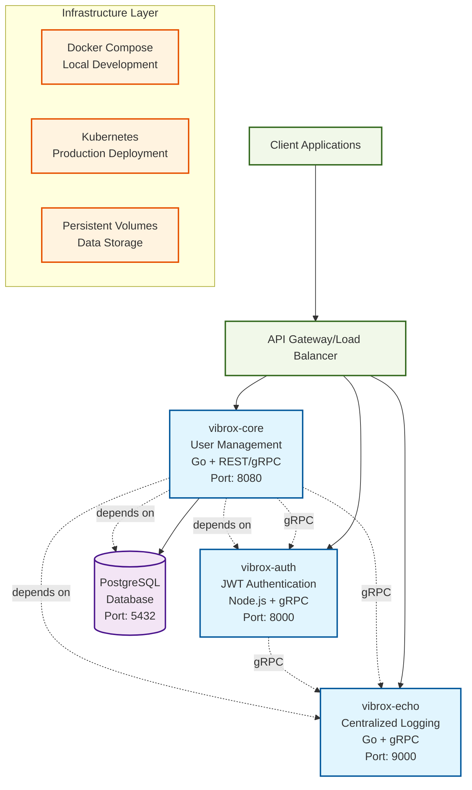

# Vibrox Stack Architecture Diagram

## System Overview

The Vibrox Stack is a microservices-based application with three core services, a PostgreSQL database, and orchestration through Docker Compose and Kubernetes.

## Service Details

### vibrox-core (User Management Service)

- **Technology**: Go with Gin framework
- **Protocols**: REST API + gRPC client
- **Port**: 8080
- **Responsibilities**:
  - User CRUD operations
  - Business logic orchestration
  - Database interactions
  - Authentication integration
  - Logging integration

### vibrox-auth (Authentication Service)

- **Technology**: Node.js with gRPC
- **Protocols**: gRPC server
- **Port**: 8000
- **Responsibilities**:
  - JWT token generation
  - Token validation
  - User authentication
  - Security token management

### vibrox-echo (Logging Service)

- **Technology**: Go with gRPC
- **Protocols**: gRPC server
- **Port**: 9000
- **Responsibilities**:
  - Centralized logging
  - Log aggregation
  - Log persistence
  - Log retrieval

### PostgreSQL Database

- **Port**: 5432
- **Purpose**: Primary data store for user data and application state
- **Persistence**: Docker volumes for data persistence

## Communication Patterns

1. **Synchronous gRPC Calls**: Services communicate via gRPC for internal operations
2. **REST API**: External clients interact via REST endpoints
3. **Database Queries**: Direct database access for data persistence
4. **Environment-based Configuration**: Service discovery via environment variables

## Deployment Options

### Docker Compose (Development)

- Single-node deployment
- Local volume mounting
- Easy development setup
- Service discovery via Docker networking

### Kubernetes (Production)

- Multi-node deployment
- Persistent volume claims
- Load balancing
- Health checks and auto-scaling
- Service mesh ready
