# Data Flow Architecture

## Overview

This document describes the data flow patterns, request/response cycles, and service communication flows within the Vibrox Stack. Understanding these flows is crucial for debugging, monitoring, and optimizing the system.

## High-Level Data Flow

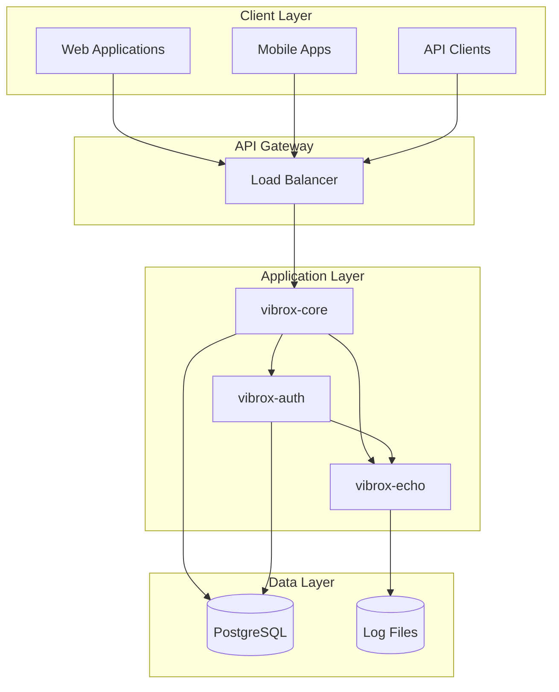
```mermaid
graph TB
    subgraph "Client Layer"
        Web[Web Applications]
        Mobile[Mobile Apps]
        API[API Clients]
    end
    
    subgraph "API Gateway"
        LB[Load Balancer]
    end
    
    subgraph "Application Layer"
        Core[vibrox-core]
        Auth[vibrox-auth]
        Logger[vibrox-echo]
    end
    
    subgraph "Data Layer"
        DB[(PostgreSQL)]
        Logs[(Log Files)]
    end
    
    Web --> LB
    Mobile --> LB
    API --> LB
    
    LB --> Core
    
    Core --> Auth
    Core --> Logger
    Core --> DB
    
    Auth --> Logger
    Auth --> DB
    
    Logger --> Logs
```

## Request Flow Patterns

### 1. User Authentication Flow

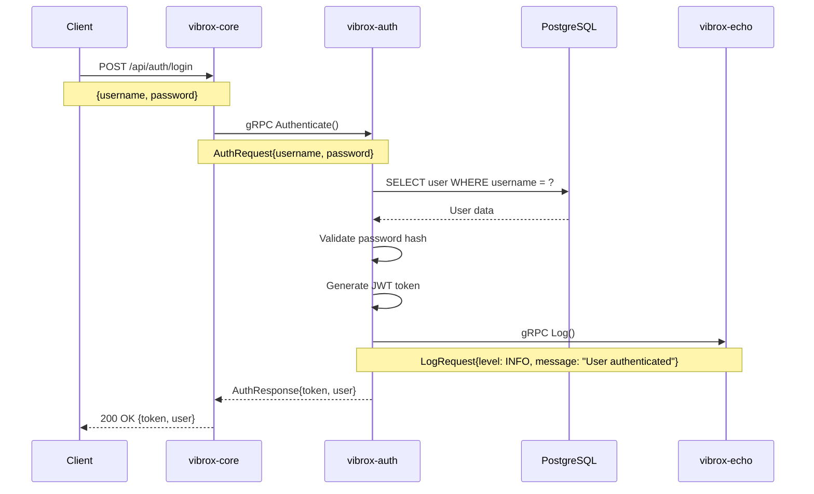
```mermaid
sequenceDiagram
    participant Client
    participant Core as vibrox-core
    participant Auth as vibrox-auth
    participant DB as PostgreSQL
    participant Logger as vibrox-echo
    
    Client->>Core: POST /api/auth/login
    Note over Client,Core: {username, password}
    
    Core->>Auth: gRPC Authenticate()
    Note over Core,Auth: AuthRequest{username, password}
    
    Auth->>DB: SELECT user WHERE username = ?
    DB-->>Auth: User data
    
    Auth->>Auth: Validate password hash
    Auth->>Auth: Generate JWT token
    
    Auth->>Logger: gRPC Log()
    Note over Auth,Logger: LogRequest{level: INFO, message: "User authenticated"}
    
    Auth-->>Core: AuthResponse{token, user}
    Core-->>Client: 200 OK {token, user}
```

### 2. User Management Flow

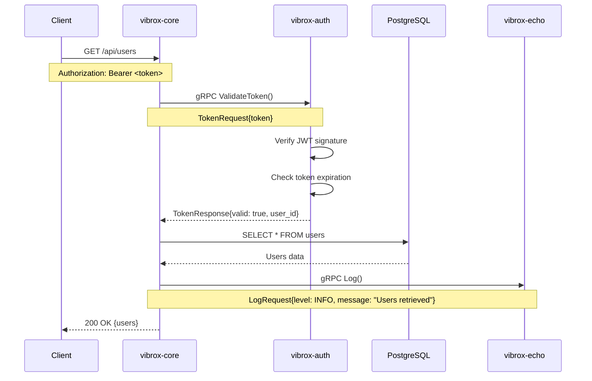
```mermaid
sequenceDiagram
    participant Client
    participant Core as vibrox-core
    participant Auth as vibrox-auth
    participant DB as PostgreSQL
    participant Logger as vibrox-echo
    
    Client->>Core: GET /api/users
    Note over Client,Core: Authorization: Bearer <token>
    
    Core->>Auth: gRPC ValidateToken()
    Note over Core,Auth: TokenRequest{token}
    
    Auth->>Auth: Verify JWT signature
    Auth->>Auth: Check token expiration
    Auth-->>Core: TokenResponse{valid: true, user_id}
    
    Core->>DB: SELECT * FROM users
    DB-->>Core: Users data
    
    Core->>Logger: gRPC Log()
    Note over Core,Logger: LogRequest{level: INFO, message: "Users retrieved"}
    
    Core-->>Client: 200 OK {users}
```

### 3. User Creation Flow

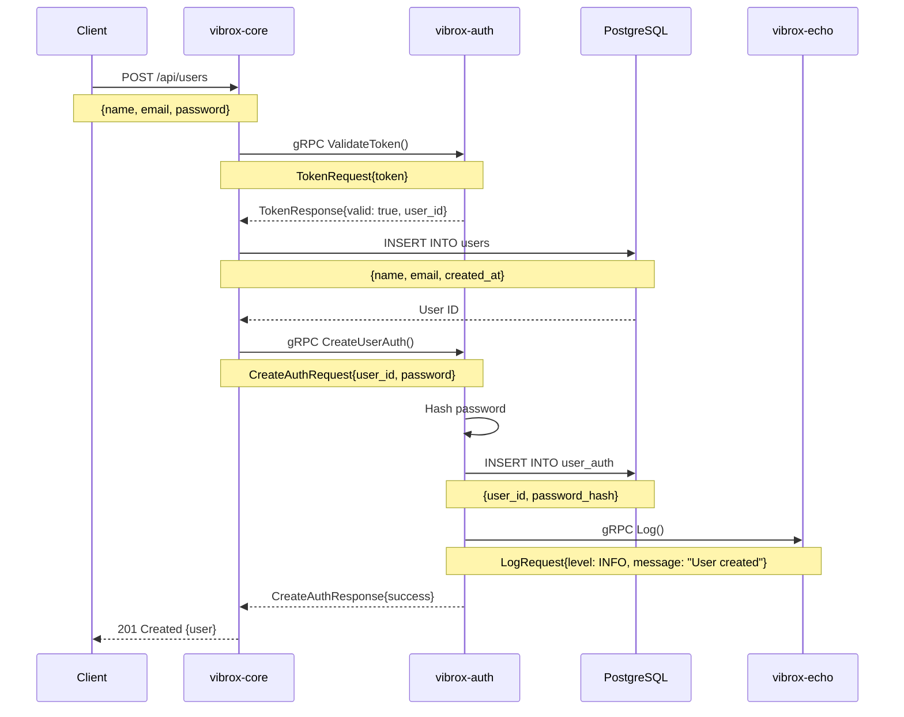
```mermaid
sequenceDiagram
    participant Client
    participant Core as vibrox-core
    participant Auth as vibrox-auth
    participant DB as PostgreSQL
    participant Logger as vibrox-echo
    
    Client->>Core: POST /api/users
    Note over Client,Core: {name, email, password}
    
    Core->>Auth: gRPC ValidateToken()
    Note over Core,Auth: TokenRequest{token}
    
    Auth-->>Core: TokenResponse{valid: true, user_id}
    
    Core->>DB: INSERT INTO users
    Note over Core,DB: {name, email, created_at}
    DB-->>Core: User ID
    
    Core->>Auth: gRPC CreateUserAuth()
    Note over Core,Auth: CreateAuthRequest{user_id, password}
    
    Auth->>Auth: Hash password
    Auth->>DB: INSERT INTO user_auth
    Note over Auth,DB: {user_id, password_hash}
    
    Auth->>Logger: gRPC Log()
    Note over Auth,Logger: LogRequest{level: INFO, message: "User created"}
    
    Auth-->>Core: CreateAuthResponse{success}
    Core-->>Client: 201 Created {user}
```

### 4. Logging Flow

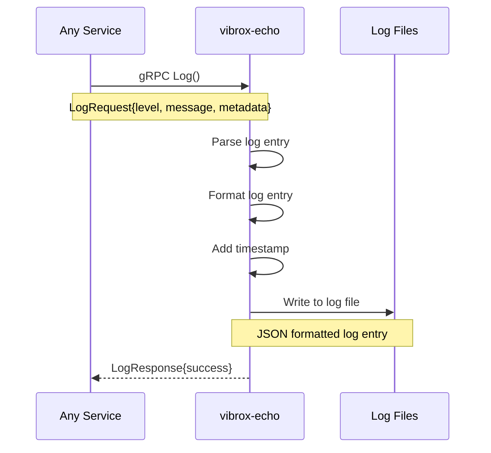
```mermaid
sequenceDiagram
    participant Service as Any Service
    participant Logger as vibrox-echo
    participant Storage as Log Files
    
    Service->>Logger: gRPC Log()
    Note over Service,Logger: LogRequest{level, message, metadata}
    
    Logger->>Logger: Parse log entry
    Logger->>Logger: Format log entry
    Logger->>Logger: Add timestamp
    
    Logger->>Storage: Write to log file
    Note over Logger,Storage: JSON formatted log entry
    
    Logger-->>Service: LogResponse{success}
```

## Data Models

### User Data Model

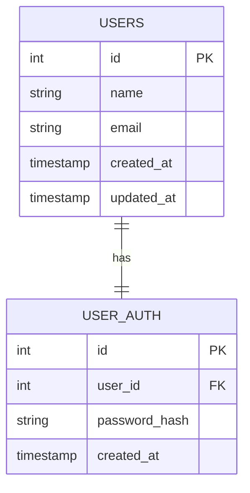
```mermaid
erDiagram
    USERS {
        int id PK
        string name
        string email
        timestamp created_at
        timestamp updated_at
    }
    
    USER_AUTH {
        int id PK
        int user_id FK
        string password_hash
        timestamp created_at
    }
    
    USERS ||--|| USER_AUTH : "has"
```

### Log Data Model

```json
{
  "timestamp": "2024-01-15T10:30:00Z",
  "level": "INFO",
  "service": "vibrox-core",
  "message": "User authenticated successfully",
  "user_id": 123,
  "request_id": "req-abc-123",
  "metadata": {
    "ip_address": "192.168.1.100",
    "user_agent": "Mozilla/5.0...",
    "endpoint": "/api/auth/login"
  }
}
```

## Error Handling Flows

### 1. Authentication Failure

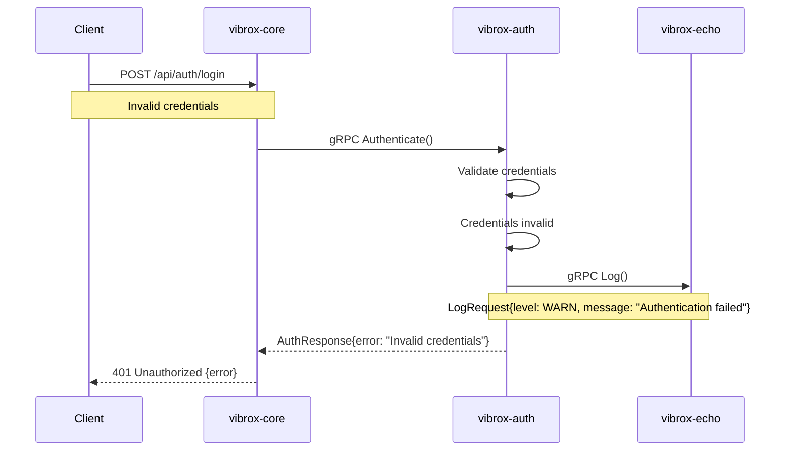
```mermaid
sequenceDiagram
    participant Client
    participant Core as vibrox-core
    participant Auth as vibrox-auth
    participant Logger as vibrox-echo
    
    Client->>Core: POST /api/auth/login
    Note over Client,Core: Invalid credentials
    
    Core->>Auth: gRPC Authenticate()
    Auth->>Auth: Validate credentials
    Auth->>Auth: Credentials invalid
    
    Auth->>Logger: gRPC Log()
    Note over Auth,Logger: LogRequest{level: WARN, message: "Authentication failed"}
    
    Auth-->>Core: AuthResponse{error: "Invalid credentials"}
    Core-->>Client: 401 Unauthorized {error}
```

### 2. Service Unavailable

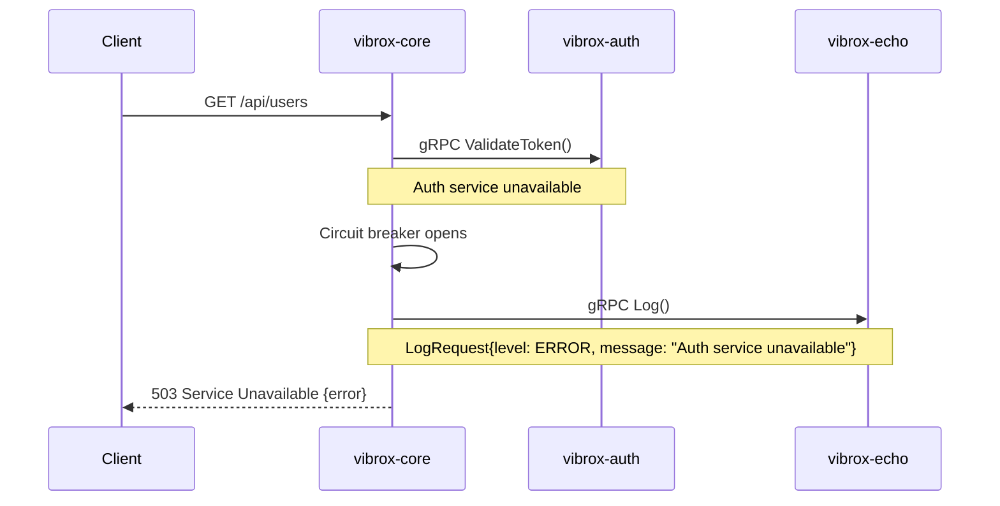
```mermaid
sequenceDiagram
    participant Client
    participant Core as vibrox-core
    participant Auth as vibrox-auth
    participant Logger as vibrox-echo
    
    Client->>Core: GET /api/users
    
    Core->>Auth: gRPC ValidateToken()
    Note over Core,Auth: Auth service unavailable
    
    Core->>Core: Circuit breaker opens
    Core->>Logger: gRPC Log()
    Note over Core,Logger: LogRequest{level: ERROR, message: "Auth service unavailable"}
    
    Core-->>Client: 503 Service Unavailable {error}
```

## Performance Considerations

### Database Connection Pooling

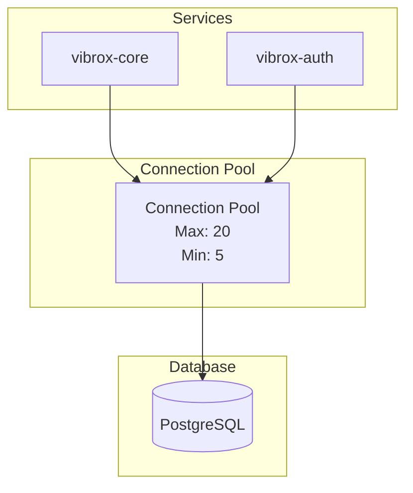
```mermaid
graph TB
    subgraph "Connection Pool"
        Pool[Connection Pool<br/>Max: 20<br/>Min: 5]
    end
    
    subgraph "Database"
        DB[(PostgreSQL)]
    end
    
    Pool --> DB
    
    subgraph "Services"
        Core[vibrox-core]
        Auth[vibrox-auth]
    end
    
    Core --> Pool
    Auth --> Pool
```

### Caching Strategy

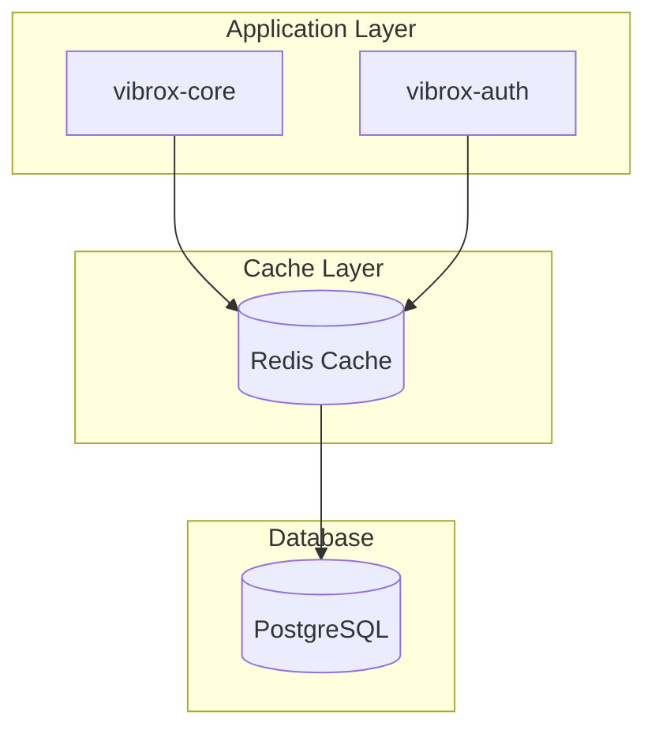
```mermaid
graph TB
    subgraph "Cache Layer"
        Redis[(Redis Cache)]
    end
    
    subgraph "Application Layer"
        Core[vibrox-core]
        Auth[vibrox-auth]
    end
    
    subgraph "Database"
        DB[(PostgreSQL)]
    end
    
    Core --> Redis
    Auth --> Redis
    Redis --> DB
```

## Monitoring and Observability

### Metrics Collection

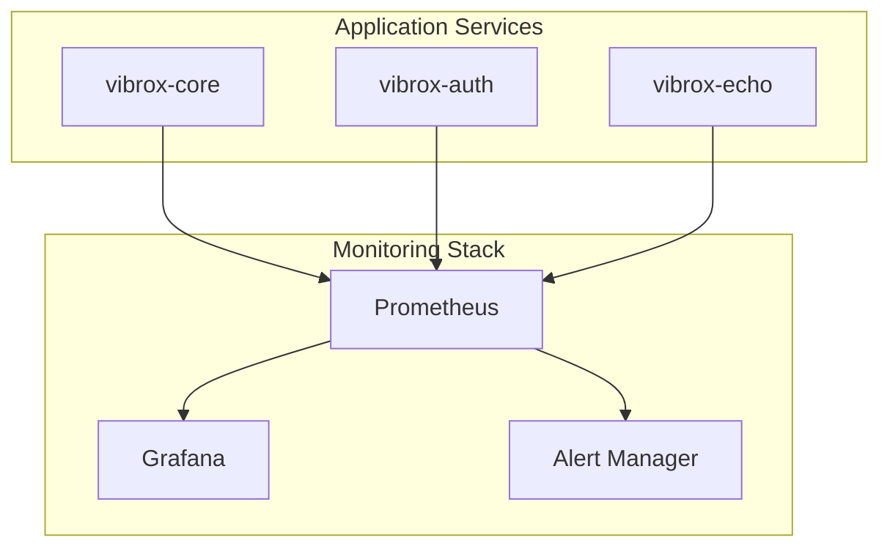
```mermaid
graph TB
    subgraph "Application Services"
        Core[vibrox-core]
        Auth[vibrox-auth]
        Logger[vibrox-echo]
    end
    
    subgraph "Monitoring Stack"
        Prometheus[Prometheus]
        Grafana[Grafana]
        AlertManager[Alert Manager]
    end
    
    Core --> Prometheus
    Auth --> Prometheus
    Logger --> Prometheus
    
    Prometheus --> Grafana
    Prometheus --> AlertManager
```

### Distributed Tracing

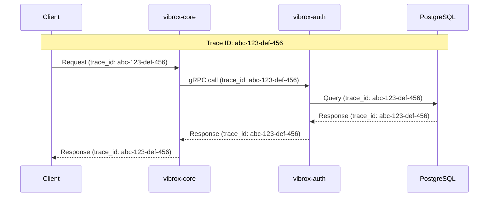
```mermaid
sequenceDiagram
    participant Client
    participant Core as vibrox-core
    participant Auth as vibrox-auth
    participant DB as PostgreSQL
    
    Note over Client,DB: Trace ID: abc-123-def-456
    
    Client->>Core: Request (trace_id: abc-123-def-456)
    Core->>Auth: gRPC call (trace_id: abc-123-def-456)
    Auth->>DB: Query (trace_id: abc-123-def-456)
    DB-->>Auth: Response (trace_id: abc-123-def-456)
    Auth-->>Core: Response (trace_id: abc-123-def-456)
    Core-->>Client: Response (trace_id: abc-123-def-456)
```

## Security Data Flow

### JWT Token Flow

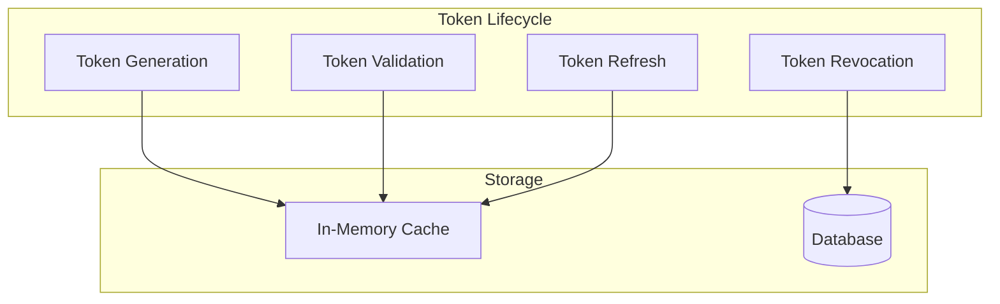
```mermaid
graph TB
    subgraph "Token Lifecycle"
        Generate[Token Generation]
        Validate[Token Validation]
        Refresh[Token Refresh]
        Revoke[Token Revocation]
    end
    
    subgraph "Storage"
        Memory[In-Memory Cache]
        DB[(Database)]
    end
    
    Generate --> Memory
    Validate --> Memory
    Refresh --> Memory
    Revoke --> DB
```

### Data Encryption Flow

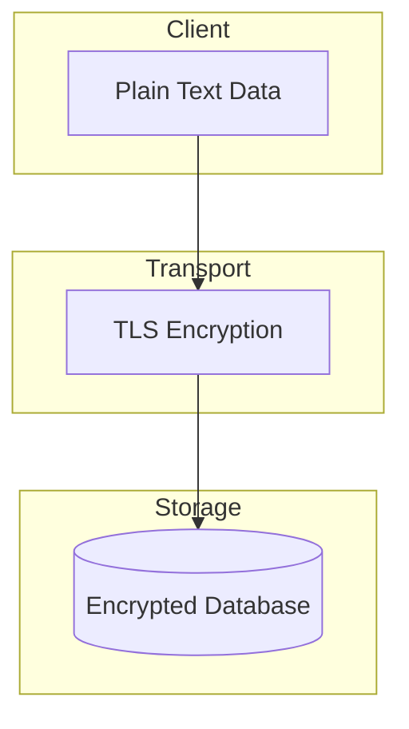
```mermaid
graph TB
    subgraph "Client"
        PlainText[Plain Text Data]
    end
    
    subgraph "Transport"
        TLS[TLS Encryption]
    end
    
    subgraph "Storage"
        EncryptedDB[(Encrypted Database)]
    end
    
    PlainText --> TLS
    TLS --> EncryptedDB
```

## Data Consistency Patterns

### Eventual Consistency

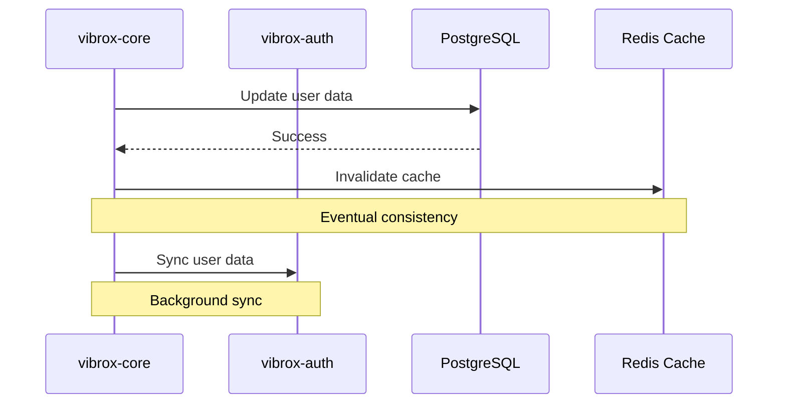
```mermaid
sequenceDiagram
    participant Core as vibrox-core
    participant Auth as vibrox-auth
    participant DB as PostgreSQL
    participant Cache as Redis Cache
    
    Core->>DB: Update user data
    DB-->>Core: Success
    
    Core->>Cache: Invalidate cache
    Note over Core,Cache: Eventual consistency
    
    Core->>Auth: Sync user data
    Note over Core,Auth: Background sync
```

### Saga Pattern for Distributed Transactions

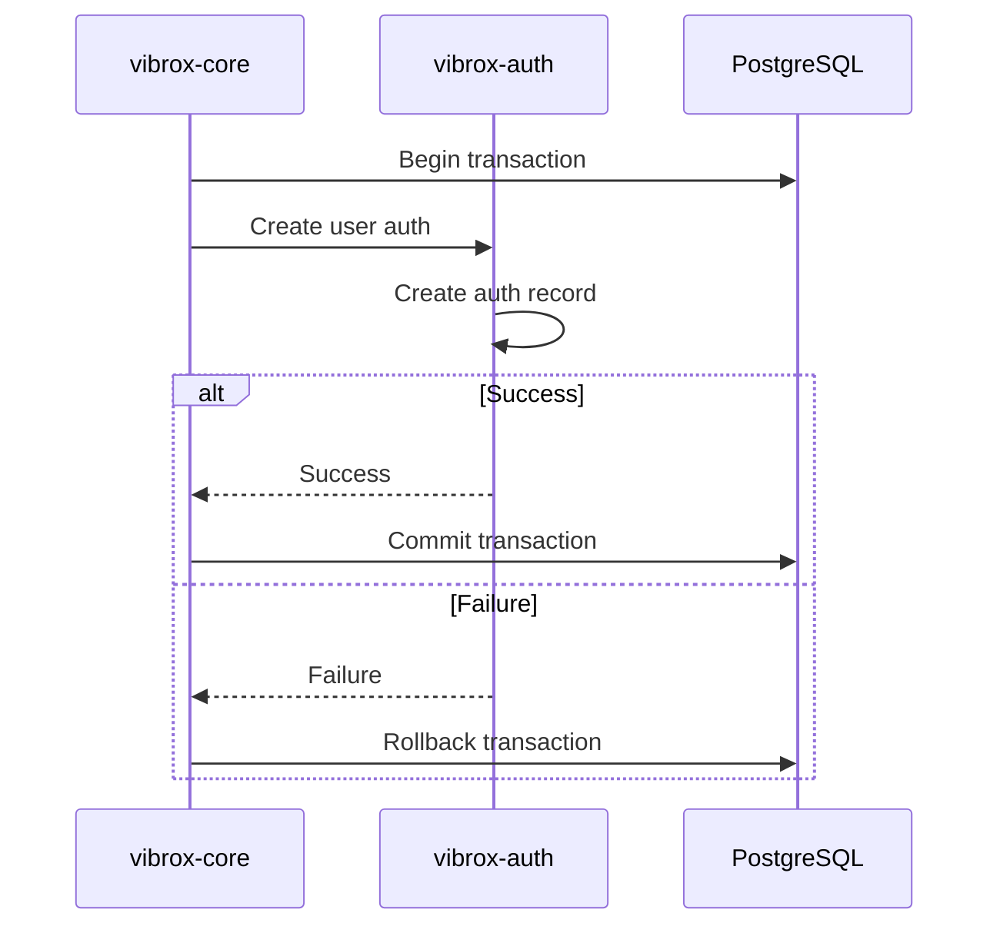
```mermaid
sequenceDiagram
    participant Core as vibrox-core
    participant Auth as vibrox-auth
    participant DB as PostgreSQL
    
    Core->>DB: Begin transaction
    Core->>Auth: Create user auth
    Auth->>Auth: Create auth record
    
    alt Success
        Auth-->>Core: Success
        Core->>DB: Commit transaction
    else Failure
        Auth-->>Core: Failure
        Core->>DB: Rollback transaction
    end
```

## Future Data Flow Enhancements

### Event-Driven Architecture

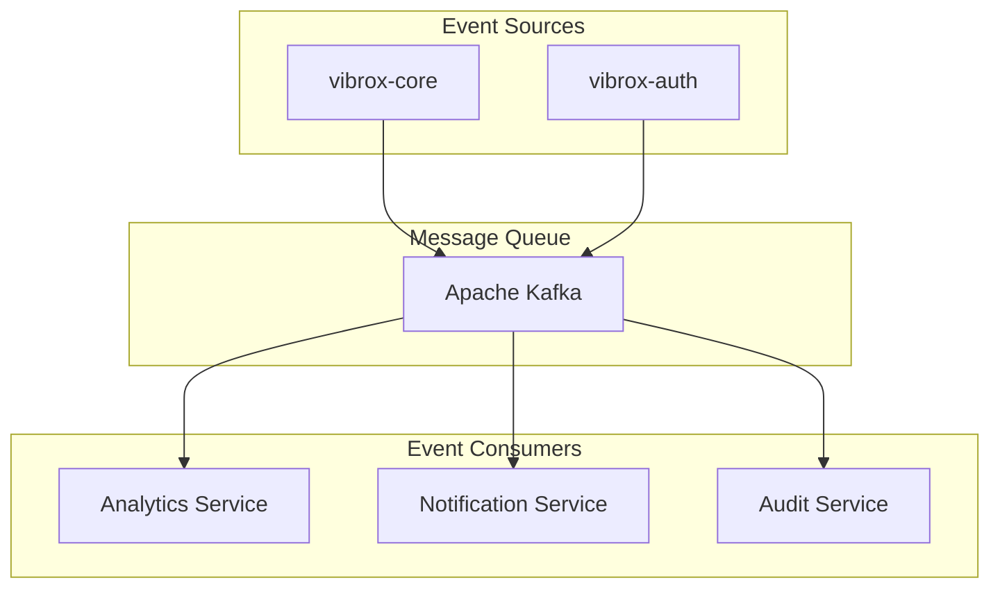
```mermaid
graph TB
    subgraph "Event Sources"
        Core[vibrox-core]
        Auth[vibrox-auth]
    end
    
    subgraph "Message Queue"
        Kafka[Apache Kafka]
    end
    
    subgraph "Event Consumers"
        Analytics[Analytics Service]
        Notifications[Notification Service]
        Audit[Audit Service]
    end
    
    Core --> Kafka
    Auth --> Kafka
    
    Kafka --> Analytics
    Kafka --> Notifications
    Kafka --> Audit
```

### API Gateway Pattern

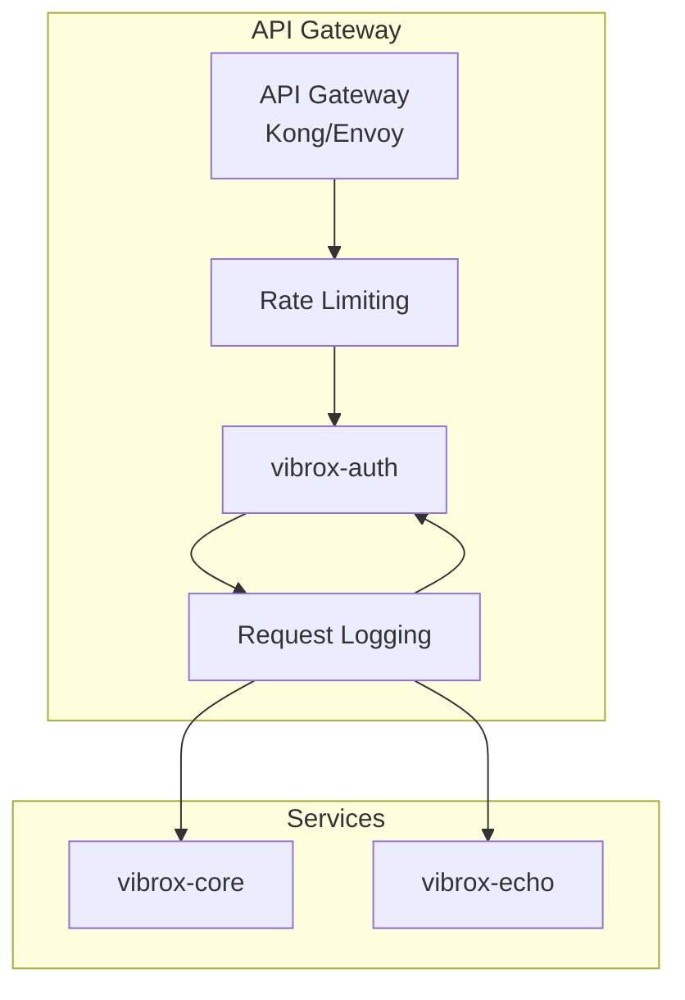
```mermaid
graph TB
    subgraph "API Gateway"
        Gateway[API Gateway<br/>Kong/Envoy]
        RateLimit[Rate Limiting]
        Auth[Authentication]
        Logging[Request Logging]
    end
    
    subgraph "Services"
        Core[vibrox-core]
        Auth[vibrox-auth]
        Logger[vibrox-echo]
    end
    
    Gateway --> RateLimit
    RateLimit --> Auth
    Auth --> Logging
    Logging --> Core
    Logging --> Auth
    Logging --> Logger
```

---

*This data flow document should be updated when significant changes are made to service communication patterns or data models. Use `/adr` to create Architecture Decision Records for major data flow decisions.*
