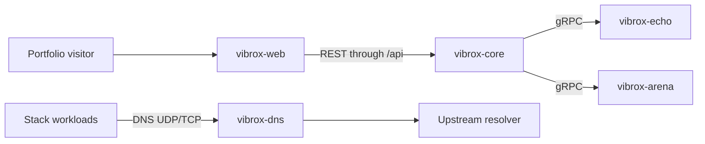

# Vibrox Stack Architecture Overview

## Purpose

Vibrox is a portfolio-backed systems lab. Its services exist to make backend,
networking, observability, and orchestration concepts interactive and visible.
It is not an account-management product.

## Active architecture

### vibrox-web

The public React application and reverse proxy. It contains the portfolio and
route-based Systems Lab experiences while keeping internal services private.

### vibrox-core

The Go API gateway for browser-safe lab operations. It currently exposes health
state and retains the internal gRPC logger connection. Arena endpoints will be
added after the game protocol is defined.

### vibrox-echo

The gRPC logging and observability experiment.

### vibrox-dns

The forwarding DNS experiment, serving UDP and TCP while remaining private by
default.

### vibrox-arena

The server-authoritative tic-tac-toe and bot service. It makes minimax
decisions, validation, latency, and request traces inspectable from vibrox-web.

## Removed runtime concepts

The original user CRUD, PostgreSQL dependency, and custom JWT service were
removed from the default runtime. The portfolio has no account requirement, so
they increased startup coupling and security surface without supporting an
interactive demonstration. If identity is needed later, use a maintained OIDC
provider rather than reviving placeholder authentication.

## Deployment

- Docker Compose provides local orchestration and service discovery.
- Kubernetes manifests demonstrate replicas, probes, resources, private
  services, and a public web entry point.
- `vibrox-web` is the only intended browser-facing service.
