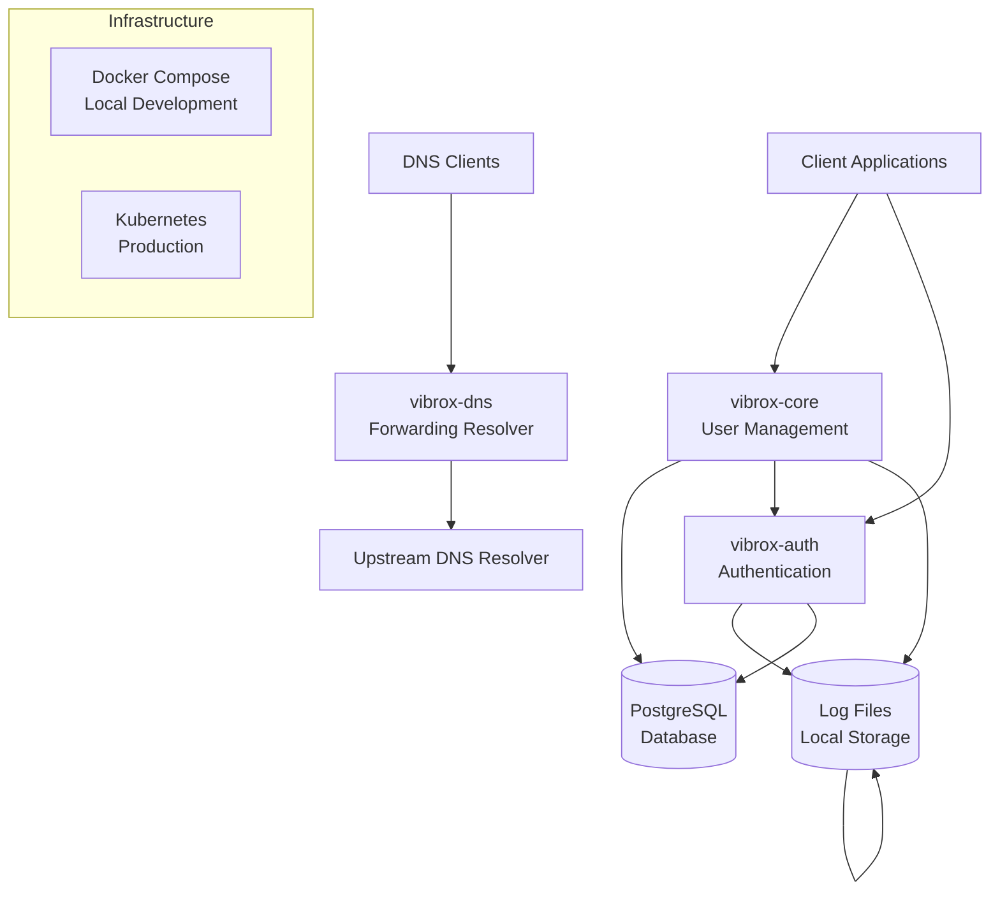
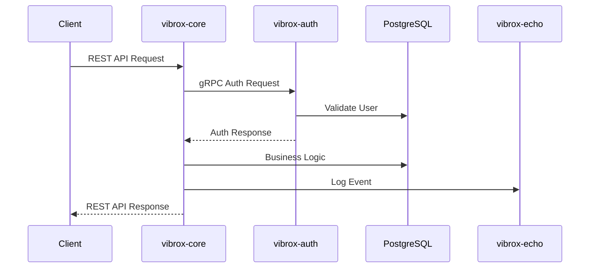

# Vibrox Stack Architecture Overview

## 🏗️ System Architecture

The Vibrox Stack is a microservices-based architecture designed for scalability, maintainability, and high availability. The system consists of three core services that work together to provide user management, authentication, and centralized logging capabilities.

## 📊 High-Level Architecture

## 🧩 Core Components

### 1. vibrox-core (User Management Service)

- **Technology**: Go with REST + gRPC APIs
- **Purpose**: Primary user management and business logic
- **Responsibilities**:
  - User CRUD operations
  - Business logic orchestration
  - Integration with other services
  - REST API endpoints for client applications

### 2. vibrox-auth (Authentication Service)

- **Technology**: Node.js with gRPC
- **Purpose**: JWT-based authentication and authorization
- **Responsibilities**:
  - User authentication
  - JWT token generation and validation
  - Session management
  - Security enforcement

### 3. vibrox-echo (Logging Service)

- **Technology**: Go with gRPC
- **Purpose**: Centralized logging and monitoring
- **Responsibilities**:
  - Structured logging
  - Log aggregation
  - Log persistence
  - Monitoring integration

### 4. PostgreSQL Database

- **Purpose**: Primary data store
- **Responsibilities**:
  - User data persistence
  - Authentication data
  - Application state management

### 5. vibrox-dns (DNS Service)

- **Technology**: Go with native DNS over UDP and TCP
- **Purpose**: Private forwarding resolver for local and cluster workloads
- **Responsibilities**:
  - Forward DNS queries to a configurable upstream
  - Support UDP and TCP transports
  - Expose an HTTP health endpoint for orchestration
  - Remain private by default to prevent an open resolver

## 🔄 Service Communication

### Communication Patterns

1. **REST APIs**: External client communication via vibrox-core
2. **gRPC**: Inter-service communication for high-performance internal calls
3. **Database**: Direct database access for data persistence

### Data Flow

## 🚀 Deployment Architecture

### Development Environment

- **Docker Compose**: Local development with service orchestration
- **Volume Mounts**: Persistent data and log storage
- **Network**: Internal service communication

### Production Environment

- **Kubernetes**: Container orchestration and scaling
- **Services**: Load balancing and service discovery
- **Persistent Volumes**: Data and log persistence
- **ConfigMaps/Secrets**: Environment configuration

## 🔐 Security Architecture

### Authentication Flow

1. Client authenticates via vibrox-auth
2. JWT tokens issued for authenticated sessions
3. Tokens validated on subsequent requests
4. Service-to-service communication secured

### Security Measures

- JWT-based authentication
- gRPC for secure inter-service communication
- Environment-based configuration
- Database connection security

## 📈 Scalability Considerations

### Horizontal Scaling

- Stateless service design
- Database connection pooling
- Load balancing support
- Container-based deployment

### Performance Optimization

- gRPC for high-performance inter-service calls
- Connection pooling
- Efficient logging strategies
- Caching opportunities

## 🔧 Technology Stack

| Component            | Technology                  | Purpose                            |
| -------------------- | --------------------------- | ---------------------------------- |
| **vibrox-core**      | Go                          | User management and business logic |
| **vibrox-auth**      | Node.js                     | Authentication and authorization   |
| **vibrox-echo**      | Go                          | Centralized logging                |
| **vibrox-dns**       | Go                          | Forwarding DNS resolver            |
| **Database**         | PostgreSQL                  | Data persistence                   |
| **Containerization** | Docker                      | Service packaging                  |
| **Orchestration**    | Docker Compose / Kubernetes | Deployment and scaling             |
| **Communication**    | gRPC / REST                 | Service communication              |

## 🎯 Design Principles

1. **Microservices**: Loosely coupled, independently deployable services
2. **Single Responsibility**: Each service has a focused purpose
3. **API-First**: Well-defined interfaces for service communication
4. **Observability**: Comprehensive logging and monitoring
5. **Security**: Authentication and authorization at every layer
6. **Scalability**: Designed for horizontal scaling
7. **Maintainability**: Clear separation of concerns and documentation

## 🔄 Future Considerations

- **Service Mesh**: Istio or Linkerd for advanced service communication
- **Monitoring**: Prometheus and Grafana integration
- **Tracing**: Distributed tracing with Jaeger
- **Caching**: Redis for performance optimization
- **Message Queue**: Event-driven architecture with Kafka/RabbitMQ

---

_This architecture document should be updated when significant architectural changes are made. Use `/adr` to create Architecture Decision Records for major decisions._
