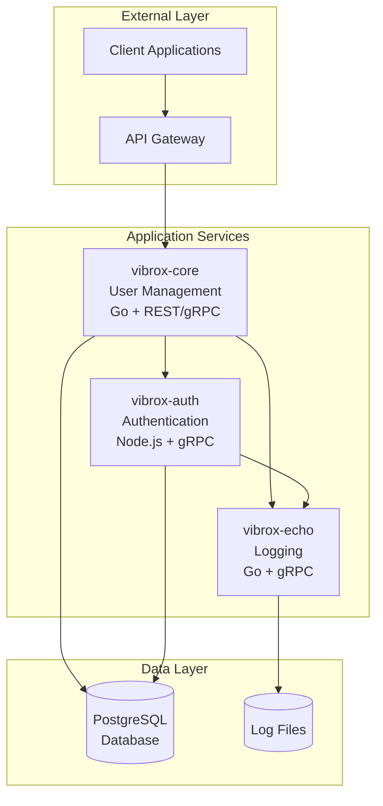
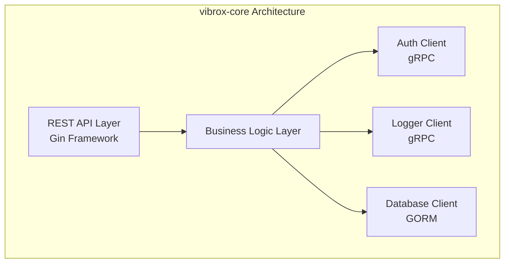
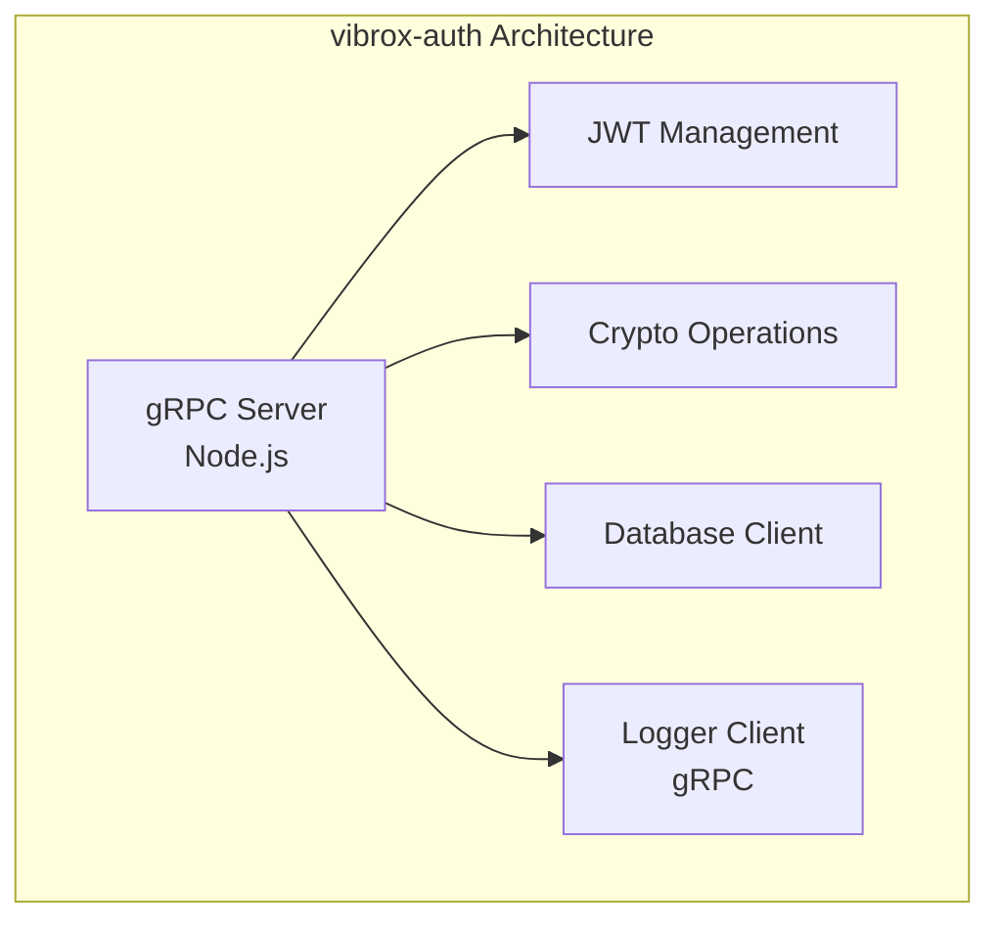
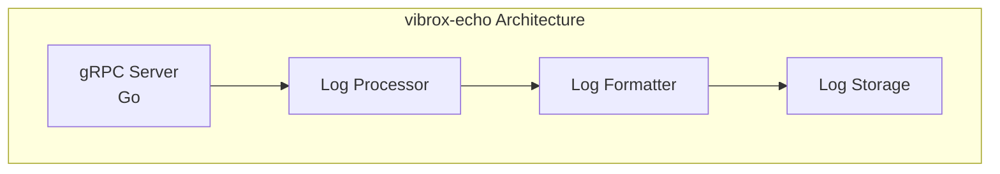
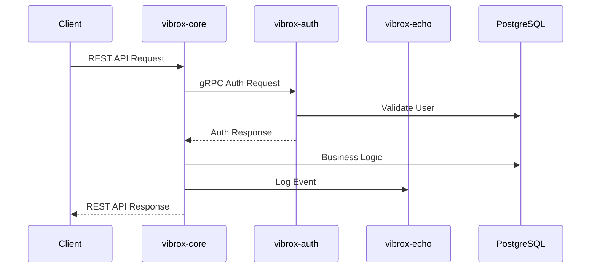

# Service Architecture

## Overview

The Vibrox Stack consists of three core microservices, each designed with specific responsibilities and clear boundaries. This document provides detailed information about each service's architecture, responsibilities, and design decisions.

## Service Overview



## vibrox-core Service

### Architecture

The `vibrox-core` service is the primary user management service built with Go. It serves as the main entry point for client applications and orchestrates business logic across the system.



### Responsibilities

- **User Management**: CRUD operations for user accounts
- **Business Logic**: Core application business rules and workflows
- **API Gateway**: Primary REST API endpoint for client applications
- **Service Orchestration**: Coordinates with auth and logging services
- **Data Persistence**: Manages user data in PostgreSQL

### Technology Stack

- **Language**: Go 1.21+
- **Web Framework**: Gin
- **ORM**: GORM
- **Communication**: gRPC client for inter-service communication
- **Database**: PostgreSQL
- **Configuration**: Environment variables

### API Endpoints

#### User Management
```http
GET    /api/users          # List all users
GET    /api/users/{id}     # Get user by ID
POST   /api/users          # Create new user
PUT    /api/users/{id}     # Update user
DELETE /api/users/{id}     # Delete user
```

#### Health & Status
```http
GET    /health             # Service health check
GET    /status             # Service status
```

### Configuration

| Environment Variable | Description | Default | Required |
|---------------------|-------------|---------|----------|
| `DB_HOST` | Database host | `db` | Yes |
| `DB_USER` | Database username | `postgres` | Yes |
| `DB_PASSWORD` | Database password | `server` | Yes |
| `DB_NAME` | Database name | `postgres` | Yes |
| `AUTH_HOST` | Auth service host | `auth:8000` | Yes |
| `LOGGER_HOST` | Logger service host | `logger:9000` | Yes |
| `PORT` | Service port | `8080` | No |

## vibrox-auth Service

### Architecture

The `vibrox-auth` service handles all authentication and authorization responsibilities using JWT tokens and gRPC communication.



### Responsibilities

- **Authentication**: User login and credential validation
- **JWT Management**: Token generation, validation, and refresh
- **Authorization**: Permission checking and access control
- **Security**: Password hashing and cryptographic operations
- **Session Management**: User session tracking and management

### Technology Stack

- **Language**: Node.js 18+
- **Framework**: gRPC server
- **Authentication**: JWT (jsonwebtoken)
- **Cryptography**: Node.js crypto module
- **Database**: PostgreSQL
- **Communication**: gRPC server

### gRPC Services

#### Authentication Service
```protobuf
service AuthService {
  rpc Authenticate(AuthRequest) returns (AuthResponse);
  rpc ValidateToken(TokenRequest) returns (TokenResponse);
  rpc RefreshToken(RefreshRequest) returns (RefreshResponse);
  rpc Logout(LogoutRequest) returns (LogoutResponse);
}
```

### Configuration

| Environment Variable | Description | Default | Required |
|---------------------|-------------|---------|----------|
| `JWT_SECRET` | JWT signing secret | - | Yes |
| `JWT_EXPIRES_IN` | Token expiration time | `24h` | No |
| `DB_HOST` | Database host | `db` | Yes |
| `DB_USER` | Database username | `postgres` | Yes |
| `DB_PASSWORD` | Database password | `server` | Yes |
| `DB_NAME` | Database name | `postgres` | Yes |
| `LOGGER_HOST` | Logger service host | `logger:9000` | Yes |
| `PORT` | Service port | `8000` | No |

## vibrox-echo Service

### Architecture

The `vibrox-echo` service provides centralized logging capabilities for the entire system using gRPC communication.



### Responsibilities

- **Log Aggregation**: Collect logs from all services
- **Log Processing**: Parse, format, and structure log entries
- **Log Storage**: Persist logs to local filesystem
- **Log Retrieval**: Provide log querying and retrieval capabilities
- **Monitoring**: Support for monitoring and alerting

### Technology Stack

- **Language**: Go 1.21+
- **Framework**: gRPC server
- **Storage**: Local filesystem
- **Communication**: gRPC server
- **Logging**: Structured logging with JSON format

### gRPC Services

#### Logging Service
```protobuf
service LogService {
  rpc Log(LogRequest) returns (LogResponse);
  rpc GetLogs(GetLogsRequest) returns (GetLogsResponse);
  rpc SearchLogs(SearchLogsRequest) returns (SearchLogsResponse);
}
```

### Log Levels

- **DEBUG**: Detailed debugging information
- **INFO**: General information messages
- **WARN**: Warning messages
- **ERROR**: Error conditions
- **FATAL**: Fatal errors that cause service termination

### Configuration

| Environment Variable | Description | Default | Required |
|---------------------|-------------|---------|----------|
| `LOG_LEVEL` | Logging level | `INFO` | No |
| `LOG_PATH` | Log file path | `./logs` | No |
| `LOG_FORMAT` | Log format (json/text) | `json` | No |
| `PORT` | Service port | `9000` | No |

## Service Communication Patterns

### Synchronous Communication

1. **gRPC Calls**: Services communicate via gRPC for internal operations
2. **REST APIs**: External clients interact via REST endpoints
3. **Database Queries**: Direct database access for data persistence

### Communication Flow



### Error Handling

- **Circuit Breaker**: Implemented for service-to-service communication
- **Retry Logic**: Automatic retry for transient failures
- **Timeout Handling**: Configurable timeouts for all requests
- **Graceful Degradation**: Services continue operating with reduced functionality

## Security Considerations

### Authentication Flow

1. Client authenticates via vibrox-auth
2. JWT tokens issued for authenticated sessions
3. Tokens validated on subsequent requests
4. Service-to-service communication secured

### Security Measures

- **JWT-based Authentication**: Secure token-based authentication
- **gRPC Security**: Secure inter-service communication
- **Environment-based Configuration**: Secure configuration management
- **Database Security**: Encrypted database connections

## Performance Considerations

### Optimization Strategies

- **Connection Pooling**: Database connection pooling
- **gRPC Efficiency**: High-performance inter-service communication
- **Logging Optimization**: Efficient log processing and storage
- **Caching**: Future implementation of caching layers

### Monitoring

- **Health Checks**: Regular health check endpoints
- **Metrics**: Service metrics collection
- **Logging**: Comprehensive logging for debugging
- **Tracing**: Distributed tracing support

## Future Enhancements

### Planned Improvements

- **Service Mesh**: Istio or Linkerd integration
- **Caching**: Redis integration for performance
- **Message Queue**: Event-driven architecture with Kafka/RabbitMQ
- **Monitoring**: Prometheus and Grafana integration
- **Tracing**: Jaeger distributed tracing

---

*This service architecture document should be updated when significant service changes are made. Use `/adr` to create Architecture Decision Records for major service design decisions.*
