# External Dependencies and Service Integrations

## Dependency Overview

This diagram shows all external dependencies, third-party libraries, and service integrations used across the Vibrox Stack microservices.

```mermaid
graph TB
    %% Vibrox Services
    subgraph "Vibrox Stack Services"
        Core[vibrox-core<br/>Go Service]
        Auth[vibrox-auth<br/>Node.js Service]
        Logger[vibrox-echo<br/>Go Service]
    end
    
    %% External Dependencies
    subgraph "External Dependencies"
        subgraph "Database"
            PostgreSQL[(PostgreSQL<br/>Database)]
        end
        
        subgraph "Containerization"
            Docker[Docker Engine]
            DockerCompose[Docker Compose]
            K8s[Kubernetes]
        end
        
        subgraph "Protocols & Communication"
            gRPC[gRPC Protocol]
            REST[REST API]
            HTTP[HTTP/HTTPS]
        end
        
        subgraph "Authentication & Security"
            JWT[JWT Tokens]
            Crypto[Crypto Module]
        end
        
        subgraph "Development Tools"
            Air[Air - Hot Reload]
            Git[Git Version Control]
            GoMod[Go Modules]
            NPM[NPM Package Manager]
        end
    end
    
    %% Third-party Libraries
    subgraph "Third-party Libraries"
        subgraph "Go Libraries"
            Gin[Gin Framework]
            GORM[GORM ORM]
            Godotenv[godotenv]
            GrpcGo[gRPC Go]
            GrpcWeb[gRPC Web]
        end
        
        subgraph "Node.js Libraries"
            JWTNode[jsonwebtoken]
            GrpcNode[gRPC Node.js]
            CryptoNode[crypto]
        end
        
        subgraph "Infrastructure"
            DockerHub[Docker Hub]
            GitHub[GitHub Repositories]
        end
    end
    
    %% Service Dependencies
    Core --> PostgreSQL
    Core --> Gin
    Core --> GORM
    Core --> Godotenv
    Core --> GrpcGo
    Core --> GrpcWeb
    Core --> Air
    
    Auth --> JWT
    Auth --> Crypto
    Auth --> JWTNode
    Auth --> GrpcNode
    Auth --> CryptoNode
    Auth --> NPM
    
    Logger --> GrpcGo
    Logger --> Air
    
    %% Infrastructure Dependencies
    Core --> Docker
    Auth --> Docker
    Logger --> Docker
    PostgreSQL --> Docker
    
    Docker --> DockerCompose
    Docker --> K8s
    
    %% Protocol Dependencies
    Core -.->|uses| gRPC
    Auth -.->|uses| gRPC
    Logger -.->|uses| gRPC
    Core -.->|exposes| REST
    Core -.->|uses| HTTP
    
    %% Security Dependencies
    Auth -.->|generates| JWT
    Auth -.->|uses| Crypto
    
    %% Development Dependencies
    Core -.->|uses| GoMod
    Auth -.->|uses| NPM
    Core -.->|uses| Git
    Auth -.->|uses| Git
    Logger -.->|uses| Git
    
    %% External Services
    Docker --> DockerHub
    Core --> GitHub
    Auth --> GitHub
    Logger --> GitHub
    
    %% Styling
    classDef service fill:#e1f5fe,stroke:#01579b,stroke-width:2px
    classDef dependency fill:#f3e5f5,stroke:#4a148c,stroke-width:2px
    classDef library fill:#fff3e0,stroke:#e65100,stroke-width:2px
    classDef external fill:#e8f5e8,stroke:#2e7d32,stroke-width:2px
    
    class Core,Auth,Logger service
    class PostgreSQL,Docker,DockerCompose,K8s,gRPC,REST,HTTP,JWT,Crypto,Air,Git,GoMod,NPM dependency
    class Gin,GORM,Godotenv,GrpcGo,GrpcWeb,JWTNode,GrpcNode,CryptoNode library
    class DockerHub,GitHub external
```



## Detailed Dependency Analysis

### vibrox-core Dependencies

#### Go Dependencies
```go
// Core Framework
github.com/gin-gonic/gin          // Web framework
github.com/joho/godotenv          // Environment variable loading

// Database
gorm.io/gorm                      // ORM for database operations
gorm.io/driver/postgres           // PostgreSQL driver

// gRPC
google.golang.org/grpc            // gRPC client/server
google.golang.org/grpc/credentials // gRPC security

// Development
github.com/cosmtrek/air           // Hot reload for development
```

#### External Services
- **PostgreSQL**: Primary database for user data
- **vibrox-auth**: JWT token validation service
- **vibrox-echo**: Centralized logging service

### vibrox-auth Dependencies

#### Node.js Dependencies
```json
{
  "dependencies": {
    "jsonwebtoken": "^9.0.0",     // JWT token handling
    "@grpc/grpc-js": "^1.8.0",    // gRPC server implementation
    "crypto": "^1.0.1"            // Cryptographic functions
  }
}
```

#### External Services
- **vibrox-echo**: Logging service integration
- **Environment Variables**: JWT secret configuration

### vibrox-echo Dependencies

#### Go Dependencies
```go
// gRPC
google.golang.org/grpc            // gRPC server
google.golang.org/protobuf        // Protocol buffers

// Development
github.com/cosmtrek/air           // Hot reload for development
```

#### External Services
- **File System**: Local log storage
- **gRPC Clients**: Service communication

## Infrastructure Dependencies

### Containerization
- **Docker**: Container runtime for all services
- **Docker Compose**: Local development orchestration
- **Kubernetes**: Production deployment orchestration

### Version Control
- **Git**: Source code version control
- **Git Submodules**: Multi-repository management
- **GitHub**: Repository hosting and CI/CD

### Development Tools
- **Air**: Hot reload for Go services
- **NPM**: Node.js package management
- **Go Modules**: Go dependency management

## Security Dependencies

### Authentication
- **JWT**: JSON Web Token implementation
- **Crypto**: Cryptographic functions for token generation
- **Environment Variables**: Secure configuration management

### Communication Security
- **gRPC**: Secure inter-service communication
- **HTTPS**: Secure external API communication

## Monitoring and Observability

### Logging
- **Centralized Logging**: All services log to vibrox-echo
- **Structured Logging**: JSON-formatted log output
- **Log Persistence**: File-based log storage

### Health Checks
- **HTTP Health Endpoints**: REST API health checks
- **gRPC Health Checks**: Service-to-service health verification
- **Database Connectivity**: Database health monitoring

## Deployment Dependencies

### Local Development
- **Docker Compose**: Service orchestration
- **Volume Mounting**: Persistent data storage
- **Port Mapping**: Service accessibility

### Production Deployment
- **Kubernetes Manifests**: Deployment configurations
- **Service Discovery**: Internal service communication
- **Load Balancing**: External traffic distribution
- **Persistent Volumes**: Data persistence across deployments
