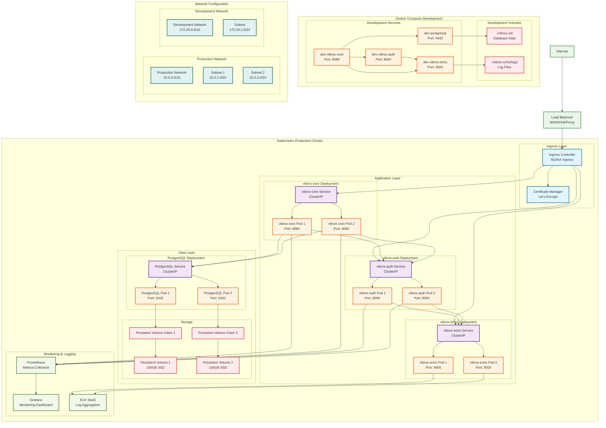

# Deployment Architecture and Infrastructure

## Deployment Overview

This diagram illustrates the deployment architecture, infrastructure components, networking, and deployment strategies for the Vibrox Stack across different environments.



## Deployment Environments

### Production Deployment (Kubernetes)

#### Infrastructure Components

- **Load Balancer**: NGINX/HAProxy for external traffic distribution
- **Ingress Controller**: NGINX Ingress for internal routing
- **Certificate Manager**: Let's Encrypt for SSL/TLS certificates
- **Persistent Storage**: SSD-based persistent volumes for data persistence

#### Service Configuration

```yaml
# Example: vibrox-core deployment
apiVersion: apps/v1
kind: Deployment
metadata:
  name: vibrox-core
spec:
  replicas: 2
  selector:
    matchLabels:
      app: vibrox-core
  template:
    metadata:
      labels:
        app: vibrox-core
    spec:
      containers:
        - name: vibrox-core
          image: viburoshin25/vibrox-core:latest
          ports:
            - containerPort: 8080
          env:
            - name: DB_HOST
              value: vibrox-db
            - name: AUTH_HOST
              value: vibrox-auth:8000
            - name: LOGGER_HOST
              value: vibrox-echo:9000
          livenessProbe:
            httpGet:
              path: /health
              port: 8080
            periodSeconds: 10
          readinessProbe:
            httpGet:
              path: /health
              port: 8080
            periodSeconds: 5
```

#### Networking Configuration

- **Production Network**: 10.0.0.0/16 with multiple subnets
- **Service Discovery**: Kubernetes DNS for internal service communication
- **Load Balancing**: Round-robin load balancing across pods
- **Health Checks**: Liveness and readiness probes for service health

### Development Deployment (Docker Compose)

#### Local Development Setup

```yaml
# docker-compose.yml
services:
  db:
    image: postgres
    ports:
      - "5432:5432"
    environment:
      - POSTGRES_USER=postgres
      - POSTGRES_PASSWORD=server
      - POSTGRES_DB=postgres
    volumes:
      - vibrox-vol:/var/lib/postgresql/data
    networks:
      - app-network

  logger:
    build: ./vibrox-echo
    ports:
      - "9000:9000"
    volumes:
      - ./vibrox-echo/logs:/app/logs
    networks:
      - app-network

  auth:
    build: ./vibrox-auth
    ports:
      - "8000:8000"
    networks:
      - app-network

  app:
    build: ./vibrox-core
    ports:
      - "8080:8080"
    environment:
      - DB_HOST=db
      - AUTH_HOST=auth:8000
      - LOGGER_HOST=logger:9000
    depends_on:
      - db
      - logger
      - auth
    networks:
      - app-network
```

#### Development Features

- **Hot Reload**: Air for Go services, nodemon for Node.js
- **Volume Mounting**: Direct file system access for development
- **Port Mapping**: Direct access to services for debugging
- **Network Isolation**: Docker network for service communication

## Infrastructure Components

### Storage Solutions

#### Production Storage

- **Persistent Volumes**: SSD-based storage for high performance
- **Volume Claims**: Dynamic provisioning of storage resources
- **Backup Strategy**: Automated backups with retention policies
- **Data Replication**: Multi-zone data replication for availability

#### Development Storage

- **Local Volumes**: Bind-mounted directories for easy access
- **Data Persistence**: Local PostgreSQL data directory
- **Log Storage**: Local log file storage for debugging

### Monitoring and Observability

#### Production Monitoring

- **Prometheus**: Metrics collection and storage
- **Grafana**: Monitoring dashboards and alerting
- **ELK Stack**: Log aggregation and analysis
- **Health Checks**: Automated health monitoring

#### Development Monitoring

- **Local Logs**: Direct access to service logs
- **Docker Logs**: Container-level logging
- **Health Endpoints**: Manual health check verification

## Deployment Strategies

### Blue-Green Deployment

1. **Blue Environment**: Current production environment
2. **Green Environment**: New version deployment
3. **Traffic Switch**: Gradual traffic migration
4. **Rollback Capability**: Quick rollback to blue environment

### Rolling Updates

- **Zero Downtime**: Continuous service availability
- **Gradual Rollout**: Incremental pod updates
- **Health Verification**: Automatic health checks during rollout
- **Rollback on Failure**: Automatic rollback on health check failures

### Canary Deployment

- **Traffic Splitting**: Percentage-based traffic distribution
- **A/B Testing**: Feature comparison in production
- **Gradual Rollout**: Incremental feature releases
- **Metrics Analysis**: Performance and error rate monitoring

## Security and Compliance

### Network Security

- **TLS/SSL**: End-to-end encryption for all communications
- **Network Policies**: Kubernetes network policies for traffic control
- **Firewall Rules**: Network-level access control
- **VPN Access**: Secure administrative access

### Data Security

- **Encryption at Rest**: Database and volume encryption
- **Encryption in Transit**: TLS encryption for all communications
- **Access Control**: Role-based access control (RBAC)
- **Audit Logging**: Comprehensive audit trail

### Compliance

- **GDPR**: Data protection and privacy compliance
- **SOC 2**: Security and availability compliance
- **ISO 27001**: Information security management
- **PCI DSS**: Payment card industry compliance (if applicable)
