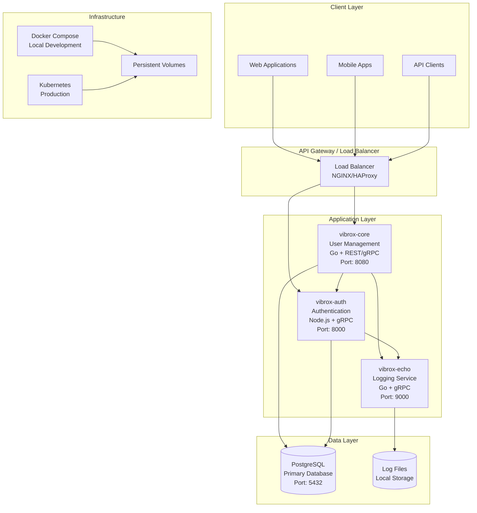
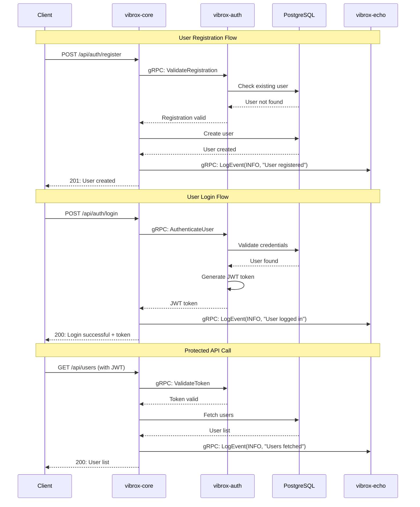
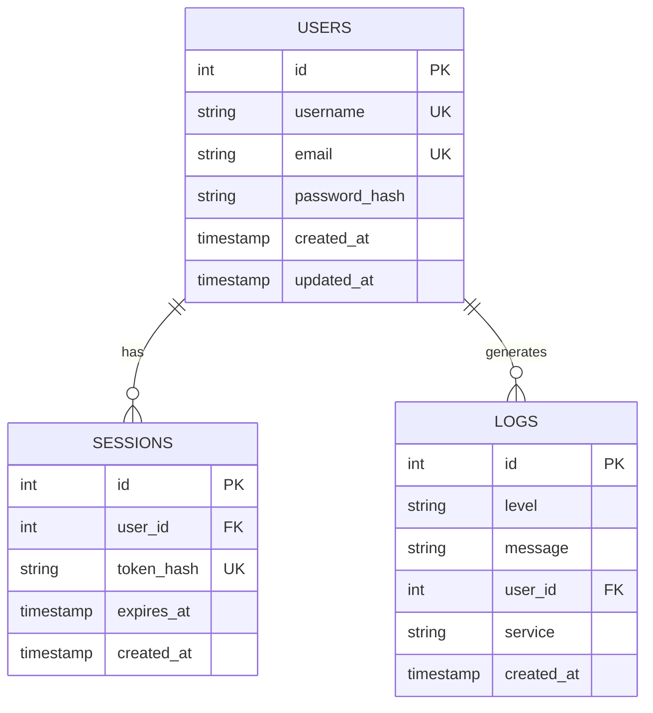
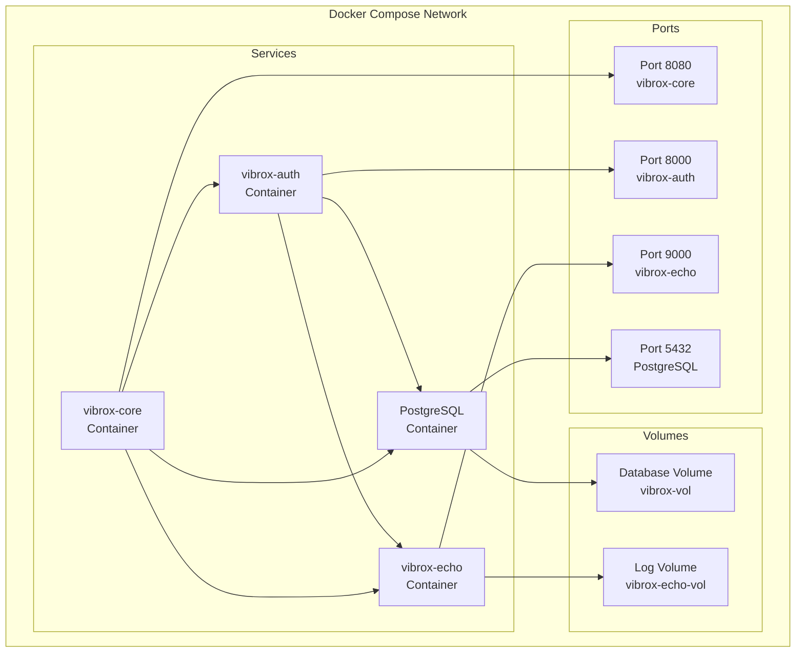
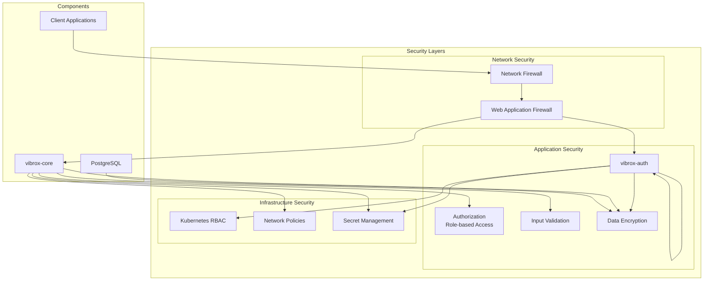
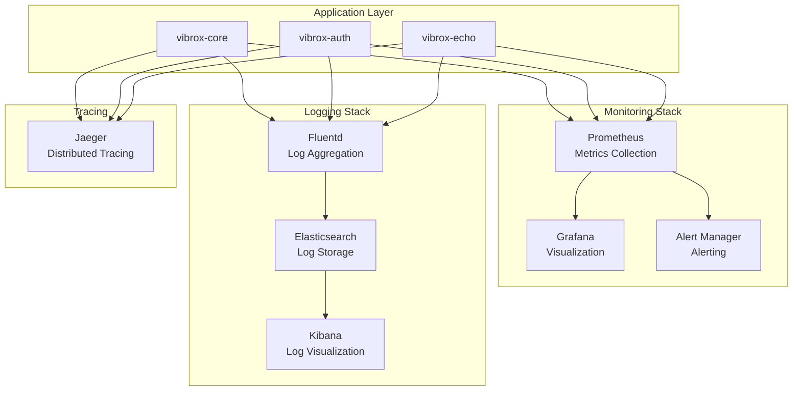
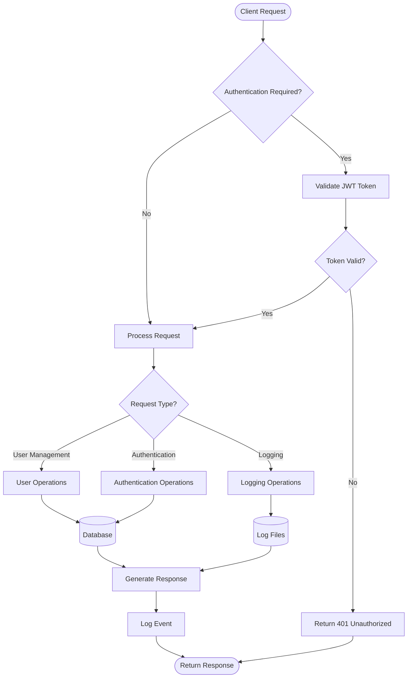

# System Architecture Diagrams

This document contains comprehensive architecture diagrams for the Vibrox Stack, providing visual representations of the system components, data flow, and deployment architecture.

## 🏗️ High-Level System Architecture



## 🔄 Service Communication Flow



## 🗄️ Database Schema Architecture



## 🐳 Docker Compose Architecture



## ☸️ Kubernetes Deployment Architecture

```mermaid
graph TB
    subgraph "Kubernetes Cluster"
        subgraph "Namespace: vibrox"
            subgraph "Deployments"
                CoreDeploy[vibrox-core<br/>Deployment<br/>Replicas: 3]
                AuthDeploy[vibrox-auth<br/>Deployment<br/>Replicas: 2]
                LoggerDeploy[vibrox-echo<br/>Deployment<br/>Replicas: 2]
                DBDeploy[PostgreSQL<br/>StatefulSet<br/>Replicas: 1]
            end
            
            subgraph "Services"
                CoreSvc[app-service<br/>ClusterIP]
                AuthSvc[auth-service<br/>ClusterIP]
                LoggerSvc[log-service<br/>ClusterIP]
                DBSvc[db-service<br/>ClusterIP]
            end
            
            subgraph "Ingress"
                Ingress[NGINX Ingress<br/>Load Balancer]
            end
            
            subgraph "Persistent Volumes"
                DBPV[Database PV<br/>Storage: 10Gi]
                LogPV[Log PV<br/>Storage: 5Gi]
            end
            
            subgraph "ConfigMaps & Secrets"
                Config[ConfigMap<br/>Environment Variables]
                Secrets[Secrets<br/>Passwords & Keys]
            end
        end
    end
    
    subgraph "External"
        Client[Client Applications]
        Storage[Cloud Storage]
    end
    
    Client --> Ingress
    Ingress --> CoreSvc
    Ingress --> AuthSvc
    
    CoreSvc --> CoreDeploy
    AuthSvc --> AuthDeploy
    LoggerSvc --> LoggerDeploy
    DBSvc --> DBDeploy
    
    CoreDeploy --> AuthSvc
    CoreDeploy --> LoggerSvc
    CoreDeploy --> DBSvc
    
    AuthDeploy --> LoggerSvc
    AuthDeploy --> DBSvc
    
    DBDeploy --> DBPV
    LoggerDeploy --> LogPV
    
    CoreDeploy --> Config
    AuthDeploy --> Config
    LoggerDeploy --> Config
    
    CoreDeploy --> Secrets
    AuthDeploy --> Secrets
    DBDeploy --> Secrets
    
    LoggerDeploy --> Storage
```

## 🔐 Security Architecture



## 📊 Monitoring & Observability



## 🔄 Data Flow Architecture



## 🚀 Deployment Pipeline

```mermaid
graph LR
    subgraph "Development"
        Code[Code Changes]
        Tests[Unit Tests]
        Build[Build Images]
    end
    
    subgraph "Staging"
        DeployStaging[Deploy to Staging]
        IntegrationTests[Integration Tests]
        PerformanceTests[Performance Tests]
    end
    
    subgraph "Production"
        DeployProd[Deploy to Production]
        HealthChecks[Health Checks]
        Monitoring[Monitoring]
    end
    
    Code --> Tests
    Tests --> Build
    Build --> DeployStaging
    DeployStaging --> IntegrationTests
    IntegrationTests --> PerformanceTests
    PerformanceTests --> DeployProd
    DeployProd --> HealthChecks
    HealthChecks --> Monitoring
```



---

*These diagrams should be updated when architectural changes are made. Use `/gen-arch-diagram` to regenerate architecture diagrams from the current codebase.*
