# Developer Onboarding Workflow

## Setup Process Overview

This diagram shows the complete developer onboarding process for the Vibrox Stack, from initial setup to running the application.

```mermaid
flowchart TD
    Start([New Developer Joins]) --> Prereq{Check Prerequisites}

    Prereq -->|Missing| InstallPrereq[Install Prerequisites<br/>- Git<br/>- Docker & Docker Compose<br/>- Go 1.21+<br/>- Node.js 18+<br/>- kubectl]
    InstallPrereq --> CloneRepo
    Prereq -->|All Present| CloneRepo[Clone Repository with Submodules]

    CloneRepo --> SubmoduleCheck{Submodules Present?}
    SubmoduleCheck -->|No| UpdateSubmodules[Update Git Submodules<br/>git submodule update --init --recursive]
    SubmoduleCheck -->|Yes| EnvSetup

    UpdateSubmodules --> EnvSetup[Environment Setup]
    EnvSetup --> DockerCheck{Docker Running?}

    DockerCheck -->|No| StartDocker[Start Docker Service]
    DockerCheck -->|Yes| ChooseDeployment

    StartDocker --> ChooseDeployment{Choose Deployment Method}

    ChooseDeployment -->|Development| DockerCompose[Use Docker Compose<br/>docker-compose up --build]
    ChooseDeployment -->|Production| K8sSetup[Setup Kubernetes<br/>- Install kubectl<br/>- Configure cluster<br/>- Apply manifests]

    DockerCompose --> ServiceCheck{All Services Running?}
    K8sSetup --> K8sDeploy[Deploy to Kubernetes<br/>kubectl apply -f manifests/]

    K8sDeploy --> K8sServiceCheck{All Pods Ready?}

    ServiceCheck -->|No| TroubleshootDocker[Debug Docker Issues<br/>- Check logs<br/>- Verify ports<br/>- Check dependencies]
    ServiceCheck -->|Yes| VerifyServices

    K8sServiceCheck -->|No| TroubleshootK8s[Debug Kubernetes Issues<br/>- Check pod status<br/>- Verify services<br/>- Check logs]
    K8sServiceCheck -->|Yes| VerifyServices

    TroubleshootDocker --> ServiceCheck
    TroubleshootK8s --> K8sServiceCheck

    VerifyServices[Verify All Services] --> TestCore[Test vibrox-core<br/>curl http://localhost:8080/health]
    TestCore --> TestAuth[Test vibrox-auth<br/>gRPC health check]
    TestAuth --> TestLogger[Test vibrox-echo<br/>gRPC health check]
    TestLogger --> TestDB[Test Database<br/>Connect to PostgreSQL]

    TestDB --> AllWorking{All Tests Pass?}

    AllWorking -->|No| DebugIssues[Debug Issues<br/>- Check service logs<br/>- Verify configurations<br/>- Test connectivity]
    AllWorking -->|Yes| SetupComplete[Setup Complete!<br/>Ready for Development]

    DebugIssues --> VerifyServices

    SetupComplete --> NextSteps[Next Steps<br/>- Read API documentation<br/>- Explore codebase<br/>- Set up IDE<br/>- Join team channels]

    %% Styling
    classDef startEnd fill:#e8f5e8,stroke:#2e7d32,stroke-width:2px
    classDef process fill:#e3f2fd,stroke:#1565c0,stroke-width:2px
    classDef decision fill:#fff3e0,stroke:#f57c00,stroke-width:2px
    classDef error fill:#ffebee,stroke:#c62828,stroke-width:2px
    classDef success fill:#e8f5e8,stroke:#2e7d32,stroke-width:2px

    class Start,SetupComplete,NextSteps startEnd
    class CloneRepo,UpdateSubmodules,EnvSetup,StartDocker,DockerCompose,K8sSetup,K8sDeploy,VerifyServices,TestCore,TestAuth,TestLogger,TestDB process
    class Prereq,SubmoduleCheck,DockerCheck,ChooseDeployment,ServiceCheck,K8sServiceCheck,AllWorking decision
    class InstallPrereq,TroubleshootDocker,TroubleshootK8s,DebugIssues error
```



## Prerequisites Checklist

### Required Software

- [ ] **Git** (latest version)
- [ ] **Docker** (20.10+) and Docker Compose (2.0+)
- [ ] **Go** (1.21 or later)
- [ ] **Node.js** (18 or later)
- [ ] **kubectl** (optional, for Kubernetes deployment)

### System Requirements

- [ ] **RAM**: Minimum 4GB, Recommended 8GB+
- [ ] **Storage**: At least 10GB free space
- [ ] **Network**: Internet connection for pulling images

## Quick Start Commands

### 1. Clone Repository

```bash
git clone --recurse-submodules https://github.com/VibuRoshin25/vibrox-stack.git
cd vibrox-stack
```

### 2. Update Submodules (if needed)

```bash
git submodule update --init --recursive
```

### 3. Start with Docker Compose

```bash
docker-compose up --build
```

### 4. Verify Services

```bash
# Check vibrox-core
curl http://localhost:8080/health

# Check vibrox-auth (gRPC)
grpcurl -plaintext localhost:8000 list

# Check vibrox-echo (gRPC)
grpcurl -plaintext localhost:9000 list

# Check database
docker exec -it vibrox-stack-db-1 psql -U postgres -d postgres
```

## Development Workflow

### Local Development

1. **Service Development**: Each service can be developed independently
2. **Hot Reload**: Services support hot reloading for development
3. **Logging**: Centralized logging through vibrox-echo
4. **Testing**: Unit and integration tests for each service

### Production Deployment

1. **Kubernetes**: Use provided manifests in `manifests/` directory
2. **Environment Variables**: Configure production environment variables
3. **Monitoring**: Set up monitoring and alerting
4. **Scaling**: Configure horizontal pod autoscaling

## Troubleshooting Guide

### Common Issues

1. **Port Conflicts**: Ensure ports 8080, 8000, 9000, 5432 are available
2. **Docker Issues**: Restart Docker service and clear containers
3. **Submodule Issues**: Re-clone with `--recurse-submodules` flag
4. **Database Connection**: Verify PostgreSQL is running and accessible

### Debug Commands

```bash
# Check service status
docker-compose ps

# View service logs
docker-compose logs [service-name]

# Check Kubernetes pods
kubectl get pods

# View pod logs
kubectl logs [pod-name]
```
