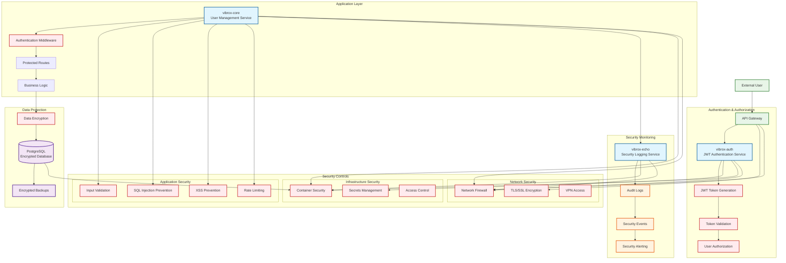

# Security Architecture and Data Protection

## Security Overview

This diagram illustrates the security architecture, authentication flow, data protection measures, and security controls implemented across the Vibrox Stack.



## Security Architecture Details

### Authentication & Authorization

#### JWT Token Flow

1. **Token Generation**: vibrox-auth generates JWT tokens with user claims
2. **Token Validation**: Middleware validates tokens on each request
3. **User Authorization**: Role-based access control for protected endpoints
4. **Token Expiration**: 15-minute token lifetime with refresh mechanism

#### Security Features

- **JWT Secret**: Environment-based secret management
- **Token Payload**: User ID and email for identification
- **Error Handling**: Secure error responses without information leakage

### Data Protection

#### Database Security

- **Connection Encryption**: TLS encryption for database connections
- **Credential Management**: Environment variable-based credentials
- **SQL Injection Prevention**: Parameterized queries via GORM
- **Data Encryption**: Field-level encryption for sensitive data

#### Backup Security

- **Encrypted Backups**: Database backups with encryption
- **Access Control**: Restricted backup access
- **Retention Policy**: Automated backup rotation

### Application Security

#### Input Validation

- **Request Validation**: All inputs validated before processing
- **Type Checking**: Strong typing for all data structures
- **Sanitization**: Input sanitization to prevent injection attacks

#### Rate Limiting

- **Request Throttling**: Per-user rate limiting
- **DDoS Protection**: Distributed denial-of-service protection
- **API Limits**: Configurable API usage limits

### Network Security

#### Transport Layer Security

- **TLS/SSL**: End-to-end encryption for all communications
- **Certificate Management**: Automated certificate rotation
- **Secure Protocols**: gRPC with TLS for inter-service communication

#### Network Controls

- **Firewall Rules**: Network-level access control
- **Port Security**: Restricted port access
- **VPN Access**: Secure remote access for administrators

### Infrastructure Security

#### Container Security

- **Image Scanning**: Vulnerability scanning for container images
- **Runtime Security**: Container runtime protection
- **Privilege Escalation**: Prevention of privilege escalation attacks

#### Secrets Management

- **Environment Variables**: Secure configuration management
- **Secret Rotation**: Automated secret rotation
- **Access Logging**: Audit trail for secret access

### Security Monitoring

#### Audit Logging

- **Request Logging**: All API requests logged with metadata
- **Authentication Events**: Login/logout events tracked
- **Authorization Failures**: Failed authorization attempts logged
- **Data Access**: Database access patterns monitored

#### Security Events

- **Anomaly Detection**: Unusual activity pattern detection
- **Alerting**: Real-time security alerts
- **Incident Response**: Automated incident response procedures

## Security Best Practices

### Code Security

```go
// Example: Secure JWT validation
func validateToken(tokenString string) (*Claims, error) {
    token, err := jwt.ParseWithClaims(tokenString, &Claims{}, func(token *jwt.Token) (interface{}, error) {
        return []byte(os.Getenv("JWT_SECRET")), nil
    })

    if err != nil {
        return nil, err
    }

    if claims, ok := token.Claims.(*Claims); ok && token.Valid {
        return claims, nil
    }

    return nil, errors.New("invalid token")
}
```

### Database Security

```sql
-- Example: Secure database connection
-- Use parameterized queries to prevent SQL injection
SELECT * FROM users WHERE email = $1 AND active = true
```

### Environment Security

```bash
# Example: Secure environment configuration
JWT_SECRET=your-super-secret-key-here
DB_PASSWORD=encrypted-database-password
API_KEY=encrypted-api-key
```

## Security Compliance

### Data Protection

- **GDPR Compliance**: User data protection and privacy
- **Data Minimization**: Collect only necessary data
- **Right to Deletion**: User data deletion capabilities
- **Data Portability**: User data export functionality

### Access Control

- **Principle of Least Privilege**: Minimal required permissions
- **Role-Based Access**: Granular permission system
- **Session Management**: Secure session handling
- **Multi-Factor Authentication**: Enhanced authentication (future)

### Incident Response

- **Security Incident Plan**: Documented response procedures
- **Forensic Capabilities**: Digital evidence preservation
- **Communication Plan**: Stakeholder notification procedures
- **Recovery Procedures**: System restoration processes
