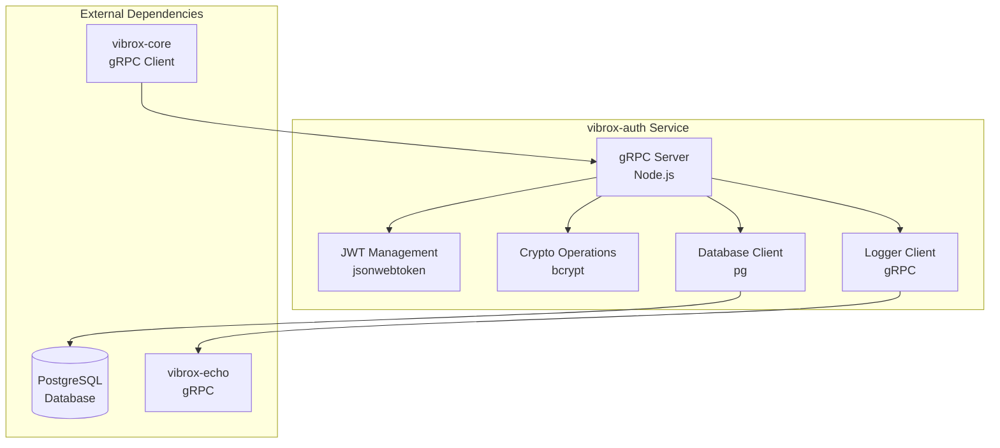
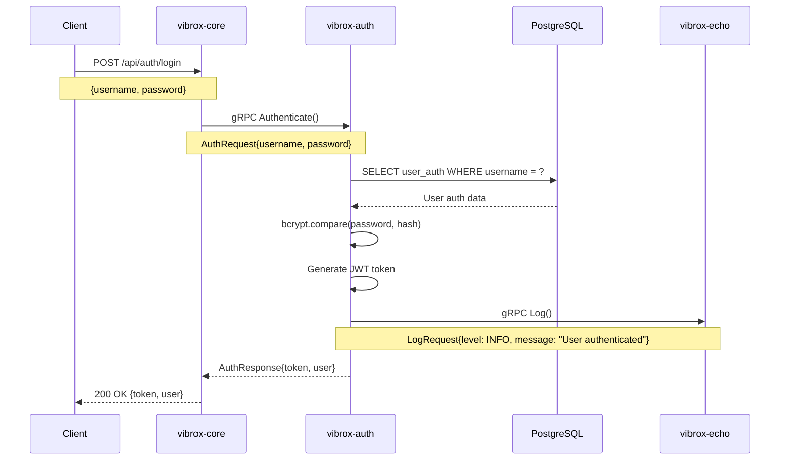
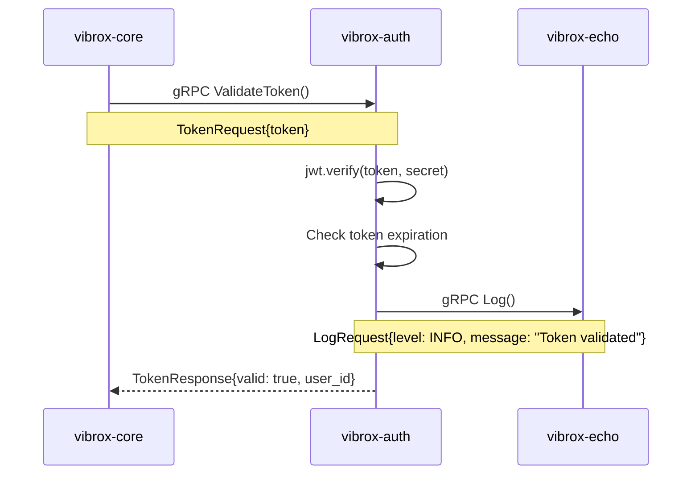

# vibrox-auth Service

The `vibrox-auth` service is the authentication and authorization component of the Vibrox Stack. Built with Node.js and gRPC, it provides JWT-based authentication, token management, and security enforcement for the entire system.

## 🎯 Overview

- **Technology**: Node.js with gRPC
- **Purpose**: JWT-based authentication and authorization
- **Port**: 8000 (gRPC)
- **Repository**: [vibrox-auth](https://github.com/VibuRoshin25/vibrox-auth)

## 🏗️ Architecture



## 🔧 Configuration

### Environment Variables

| Variable         | Description           | Default       | Required |
| ---------------- | --------------------- | ------------- | -------- |
| `JWT_SECRET`     | JWT signing secret    | -             | Yes      |
| `JWT_EXPIRES_IN` | Token expiration time | `24h`         | No       |
| `DB_HOST`        | Database host         | `db`          | Yes      |
| `DB_USER`        | Database username     | `postgres`    | Yes      |
| `DB_PASSWORD`    | Database password     | `server`      | Yes      |
| `DB_NAME`        | Database name         | `postgres`    | Yes      |
| `DB_PORT`        | Database port         | `5432`        | No       |
| `LOGGER_HOST`    | Logging service host  | `logger:9000` | Yes      |
| `PORT`           | Service port          | `8000`        | No       |
| `NODE_ENV`       | Node.js environment   | `development` | No       |

### Docker Configuration

```yaml
auth:
  build: ./vibrox-auth
  ports:
    - "8000:8000"
  environment:
    - JWT_SECRET=your-super-secret-jwt-key
    - JWT_EXPIRES_IN=24h
    - DB_HOST=db
    - DB_USER=postgres
    - DB_PASSWORD=server
    - DB_NAME=postgres
    - LOGGER_HOST=logger:9000
  depends_on:
    - db
    - logger
  networks:
    - app-network
```

## 📡 gRPC API

### Authentication Service

```protobuf
service AuthService {
  // Authenticate user with credentials
  rpc Authenticate(AuthRequest) returns (AuthResponse);

  // Validate JWT token
  rpc ValidateToken(TokenRequest) returns (TokenResponse);

  // Refresh JWT token
  rpc RefreshToken(RefreshRequest) returns (RefreshResponse);

  // Logout user (invalidate token)
  rpc Logout(LogoutRequest) returns (LogoutResponse);

  // Create user authentication record
  rpc CreateUserAuth(CreateAuthRequest) returns (CreateAuthResponse);

  // Update user password
  rpc UpdatePassword(UpdatePasswordRequest) returns (UpdatePasswordResponse);
}
```

### Message Definitions

```protobuf
// Authentication request
message AuthRequest {
  string username = 1;
  string password = 2;
}

// Authentication response
message AuthResponse {
  bool success = 1;
  string token = 2;
  User user = 3;
  string error = 4;
}

// Token validation request
message TokenRequest {
  string token = 1;
}

// Token validation response
message TokenResponse {
  bool valid = 1;
  int32 user_id = 2;
  string error = 3;
}

// User information
message User {
  int32 id = 1;
  string name = 2;
  string email = 3;
  string created_at = 4;
  string updated_at = 5;
}
```

## 🔐 Authentication Flow

### 1. User Login



### 2. Token Validation



## 🗄️ Database Schema

### User Authentication Table

```sql
-- User authentication table
CREATE TABLE user_auth (
    id SERIAL PRIMARY KEY,
    user_id INTEGER REFERENCES users(id) ON DELETE CASCADE,
    username VARCHAR(255) UNIQUE NOT NULL,
    password_hash VARCHAR(255) NOT NULL,
    created_at TIMESTAMP DEFAULT CURRENT_TIMESTAMP,
    updated_at TIMESTAMP DEFAULT CURRENT_TIMESTAMP
);

-- Indexes for performance
CREATE INDEX idx_user_auth_username ON user_auth(username);
CREATE INDEX idx_user_auth_user_id ON user_auth(user_id);

-- Trigger to update updated_at timestamp
CREATE OR REPLACE FUNCTION update_updated_at_column()
RETURNS TRIGGER AS $$
BEGIN
    NEW.updated_at = CURRENT_TIMESTAMP;
    RETURN NEW;
END;
$$ language 'plpgsql';

CREATE TRIGGER update_user_auth_updated_at
    BEFORE UPDATE ON user_auth
    FOR EACH ROW
    EXECUTE FUNCTION update_updated_at_column();
```

### Token Blacklist Table (Optional)

```sql
-- Token blacklist for logout functionality
CREATE TABLE token_blacklist (
    id SERIAL PRIMARY KEY,
    token_hash VARCHAR(255) UNIQUE NOT NULL,
    expires_at TIMESTAMP NOT NULL,
    created_at TIMESTAMP DEFAULT CURRENT_TIMESTAMP
);

-- Index for performance
CREATE INDEX idx_token_blacklist_expires_at ON token_blacklist(expires_at);

-- Cleanup expired tokens (run periodically)
DELETE FROM token_blacklist WHERE expires_at < CURRENT_TIMESTAMP;
```

## 🔒 Security Features

### Password Hashing

```javascript
const bcrypt = require("bcrypt");

// Hash password
const saltRounds = 12;
const passwordHash = await bcrypt.hash(password, saltRounds);

// Verify password
const isValid = await bcrypt.compare(password, passwordHash);
```

### JWT Token Management

```javascript
const jwt = require("jsonwebtoken");

// Generate token
const token = jwt.sign(
  { user_id: user.id, username: user.username },
  process.env.JWT_SECRET,
  { expiresIn: process.env.JWT_EXPIRES_IN || "24h" }
);

// Verify token
const decoded = jwt.verify(token, process.env.JWT_SECRET);
```

### Rate Limiting

```javascript
const rateLimit = require("express-rate-limit");

const authLimiter = rateLimit({
  windowMs: 15 * 60 * 1000, // 15 minutes
  max: 5, // limit each IP to 5 requests per windowMs
  message: "Too many authentication attempts",
});
```

## 📊 Monitoring and Logging

### Health Check

```javascript
// Health check endpoint
app.get("/health", (req, res) => {
  res.json({
    status: "healthy",
    service: "vibrox-auth",
    timestamp: new Date().toISOString(),
    uptime: process.uptime(),
  });
});
```

### Metrics Collection

```javascript
const prometheus = require("prom-client");

// Custom metrics
const authRequestsTotal = new prometheus.Counter({
  name: "auth_requests_total",
  help: "Total number of authentication requests",
  labelNames: ["method", "status"],
});

const tokenValidationsTotal = new prometheus.Counter({
  name: "token_validations_total",
  help: "Total number of token validations",
  labelNames: ["status"],
});
```

### Structured Logging

```javascript
const winston = require("winston");

const logger = winston.createLogger({
  level: "info",
  format: winston.format.json(),
  transports: [
    new winston.transports.Console(),
    new winston.transports.File({ filename: "auth.log" }),
  ],
});

// Log authentication events
logger.info("User authenticated", {
  user_id: user.id,
  username: user.username,
  ip_address: req.ip,
  user_agent: req.get("User-Agent"),
});
```

## 🧪 Testing

### Unit Tests

```javascript
// auth.test.js
const request = require("supertest");
const app = require("../app");

describe("Authentication Service", () => {
  test("should authenticate valid user", async () => {
    const response = await request(app).post("/auth/login").send({
      username: "testuser",
      password: "password123",
    });

    expect(response.status).toBe(200);
    expect(response.body).toHaveProperty("token");
    expect(response.body).toHaveProperty("user");
  });

  test("should reject invalid credentials", async () => {
    const response = await request(app).post("/auth/login").send({
      username: "testuser",
      password: "wrongpassword",
    });

    expect(response.status).toBe(401);
    expect(response.body).toHaveProperty("error");
  });
});
```

### Integration Tests

```javascript
// integration.test.js
describe("gRPC Integration Tests", () => {
  test("should validate token via gRPC", async () => {
    const client = new AuthServiceClient("localhost:8000");

    const request = new TokenRequest();
    request.setToken(validToken);

    const response = await client.validateToken(request);
    expect(response.getValid()).toBe(true);
  });
});
```

## 🚀 Performance Optimization

### Connection Pooling

```javascript
const { Pool } = require("pg");

const pool = new Pool({
  host: process.env.DB_HOST,
  port: process.env.DB_PORT || 5432,
  database: process.env.DB_NAME,
  user: process.env.DB_USER,
  password: process.env.DB_PASSWORD,
  max: 20, // maximum number of clients
  idleTimeoutMillis: 30000,
  connectionTimeoutMillis: 2000,
});
```

### Caching Strategy

```javascript
const Redis = require("ioredis");

const redis = new Redis({
  host: process.env.REDIS_HOST || "localhost",
  port: process.env.REDIS_PORT || 6379,
});

// Cache token validation results
async function validateTokenWithCache(token) {
  const cacheKey = `token:${token}`;
  const cached = await redis.get(cacheKey);

  if (cached) {
    return JSON.parse(cached);
  }

  const result = await validateToken(token);
  await redis.setex(cacheKey, 300, JSON.stringify(result)); // 5 minutes

  return result;
}
```

## 🔧 Development Setup

### Local Development

```bash
# Clone the repository
git clone https://github.com/VibuRoshin25/vibrox-auth.git
cd vibrox-auth

# Install dependencies
npm install

# Set environment variables
cp .env.example .env
# Edit .env with your configuration

# Start development server
npm run dev

# Run tests
npm test
```

### Docker Development

```bash
# Build and run with Docker
docker build -t vibrox-auth .
docker run -p 8000:8000 vibrox-auth

# Or use Docker Compose
docker-compose up auth
```

## 📈 Scaling Considerations

### Horizontal Scaling

```yaml
# Kubernetes deployment with multiple replicas
apiVersion: apps/v1
kind: Deployment
metadata:
  name: vibrox-auth
spec:
  replicas: 3
  selector:
    matchLabels:
      app: vibrox-auth
  template:
    spec:
      containers:
        - name: vibrox-auth
          image: vibrox-auth:latest
          ports:
            - containerPort: 8000
```

### Load Balancing

```yaml
# Kubernetes service for load balancing
apiVersion: v1
kind: Service
metadata:
  name: vibrox-auth-service
spec:
  selector:
    app: vibrox-auth
  ports:
    - port: 8000
      targetPort: 8000
  type: ClusterIP
```

## 🔍 Troubleshooting

### Common Issues

#### 1. Database Connection Issues

```bash
# Check database connectivity
docker-compose exec auth ping db
docker-compose exec auth nc -zv db 5432

# Check database logs
docker-compose logs db
```

#### 2. JWT Token Issues

```bash
# Verify JWT secret is set
echo $JWT_SECRET

# Test JWT token generation
node -e "console.log(require('jsonwebtoken').sign({test: 'data'}, 'your-secret'))"
```

#### 3. gRPC Connection Issues

```bash
# Test gRPC connectivity
grpcurl -plaintext localhost:8000 list

# Check gRPC health
grpcurl -plaintext localhost:8000 grpc.health.v1.Health/Check
```

### Debug Mode

```javascript
// Enable debug logging
process.env.DEBUG = "vibrox-auth:*";

// Add debug statements
const debug = require("debug")("vibrox-auth:auth");

debug("Processing authentication request for user: %s", username);
```

## 🔗 Integration Examples

### Go Client Integration

```go
package main

import (
    "context"
    "log"
    "google.golang.org/grpc"
    pb "path/to/auth/proto"
)

func main() {
    conn, err := grpc.Dial("localhost:8000", grpc.WithInsecure())
    if err != nil {
        log.Fatal(err)
    }
    defer conn.Close()

    client := pb.NewAuthServiceClient(conn)

    // Authenticate user
    resp, err := client.Authenticate(context.Background(), &pb.AuthRequest{
        Username: "testuser",
        Password: "password123",
    })

    if err != nil {
        log.Fatal(err)
    }

    log.Printf("Token: %s", resp.Token)
}
```

### Node.js Client Integration

```javascript
const { AuthServiceClient } = require("./auth_grpc_pb");
const { AuthRequest } = require("./auth_pb");

const client = new AuthServiceClient("localhost:8000");

async function authenticateUser(username, password) {
  const request = new AuthRequest();
  request.setUsername(username);
  request.setPassword(password);

  try {
    const response = await client.authenticate(request);
    return {
      success: response.getSuccess(),
      token: response.getToken(),
      user: response.getUser(),
    };
  } catch (error) {
    console.error("Authentication failed:", error);
    throw error;
  }
}
```

---

_This service documentation should be updated when significant changes are made to the authentication service. Use `/adr` to create Architecture Decision Records for major authentication decisions._
