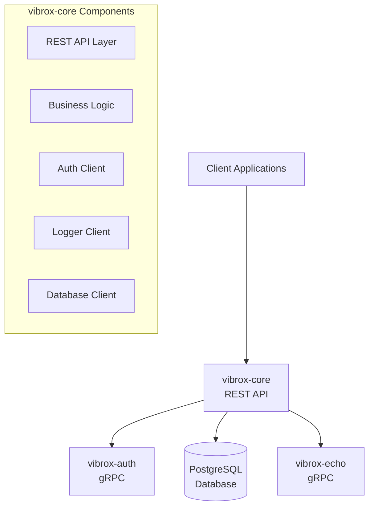

# vibrox-core Service

The `vibrox-core` service is the primary user management and business logic service in the Vibrox Stack. Built with Go, it provides REST APIs for client applications and integrates with other services via gRPC.

## 🎯 Overview

- **Technology**: Go with REST + gRPC APIs
- **Purpose**: User management and business logic orchestration
- **Port**: 8080 (REST API)
- **Repository**: [vibrox-core](https://github.com/VibuRoshin25/vibrox-core)

## 🏗️ Architecture



## 🔧 Configuration

### Environment Variables

| Variable | Description | Default | Required |
|----------|-------------|---------|----------|
| `DB_HOST` | Database host | `db` | Yes |
| `DB_USER` | Database username | `postgres` | Yes |
| `DB_PASSWORD` | Database password | `server` | Yes |
| `DB_NAME` | Database name | `postgres` | Yes |
| `AUTH_HOST` | Authentication service host | `auth:8000` | Yes |
| `LOGGER_HOST` | Logging service host | `logger:9000` | Yes |
| `PORT` | Service port | `8080` | No |

### Docker Configuration

```yaml
app:
  build: ./vibrox-core
  ports:
    - "8080:8080"
  environment:
    - DB_HOST=db
    - DB_USER=postgres
    - DB_PASSWORD=server
    - DB_NAME=postgres
    - AUTH_HOST=auth:8000
    - LOGGER_HOST=logger:9000
  depends_on:
    - db
    - logger
    - auth
  networks:
    - app-network
```

## 📡 API Endpoints

### REST API

#### User Management

```http
# Get all users
GET /api/users
Authorization: Bearer <jwt-token>

# Get user by ID
GET /api/users/{id}
Authorization: Bearer <jwt-token>

# Create user
POST /api/users
Content-Type: application/json
Authorization: Bearer <jwt-token>

{
  "username": "john_doe",
  "email": "john@example.com",
  "password": "secure_password"
}

# Update user
PUT /api/users/{id}
Content-Type: application/json
Authorization: Bearer <jwt-token>

{
  "username": "john_doe_updated",
  "email": "john.updated@example.com"
}

# Delete user
DELETE /api/users/{id}
Authorization: Bearer <jwt-token>
```

#### Authentication

```http
# Login
POST /api/auth/login
Content-Type: application/json

{
  "username": "john_doe",
  "password": "secure_password"
}

# Register
POST /api/auth/register
Content-Type: application/json

{
  "username": "new_user",
  "email": "new@example.com",
  "password": "secure_password"
}

# Refresh token
POST /api/auth/refresh
Authorization: Bearer <refresh-token>
```

#### Health Checks

```http
# Health check
GET /health

# Readiness check
GET /ready

# Metrics (Prometheus)
GET /metrics
```

### Response Formats

#### Success Response
```json
{
  "success": true,
  "data": {
    "id": 1,
    "username": "john_doe",
    "email": "john@example.com",
    "created_at": "2024-01-01T00:00:00Z"
  },
  "message": "User created successfully"
}
```

#### Error Response
```json
{
  "success": false,
  "error": {
    "code": "VALIDATION_ERROR",
    "message": "Invalid email format",
    "details": {
      "email": "must be a valid email address"
    }
  }
}
```

## 🔐 Authentication & Authorization

### JWT Token Validation

All protected endpoints require a valid JWT token in the Authorization header:

```http
Authorization: Bearer <jwt-token>
```

### Token Structure

```json
{
  "sub": "user_id",
  "username": "john_doe",
  "email": "john@example.com",
  "exp": 1640995200,
  "iat": 1640908800
}
```

## 🗄️ Database Schema

### Users Table

```sql
CREATE TABLE users (
    id SERIAL PRIMARY KEY,
    username VARCHAR(50) UNIQUE NOT NULL,
    email VARCHAR(100) UNIQUE NOT NULL,
    password_hash VARCHAR(255) NOT NULL,
    created_at TIMESTAMP DEFAULT CURRENT_TIMESTAMP,
    updated_at TIMESTAMP DEFAULT CURRENT_TIMESTAMP
);

CREATE INDEX idx_users_username ON users(username);
CREATE INDEX idx_users_email ON users(email);
```

### Sessions Table

```sql
CREATE TABLE sessions (
    id SERIAL PRIMARY KEY,
    user_id INTEGER REFERENCES users(id),
    token_hash VARCHAR(255) UNIQUE NOT NULL,
    expires_at TIMESTAMP NOT NULL,
    created_at TIMESTAMP DEFAULT CURRENT_TIMESTAMP
);

CREATE INDEX idx_sessions_user_id ON sessions(user_id);
CREATE INDEX idx_sessions_token_hash ON sessions(token_hash);
```

## 🔄 Service Integration

### gRPC Clients

#### Authentication Service Client
```go
// Connect to auth service
authClient := grpc.NewClient(authHost)

// Validate token
token, err := authClient.ValidateToken(ctx, &pb.TokenRequest{
    Token: jwtToken,
})
```

#### Logging Service Client
```go
// Connect to logging service
loggerClient := grpc.NewClient(loggerHost)

// Log event
_, err := loggerClient.LogEvent(ctx, &pb.LogRequest{
    Level:   "INFO",
    Message: "User created successfully",
    UserId:  userId,
})
```

## 🧪 Testing

### Unit Tests
```bash
# Run all tests
go test ./...

# Run tests with coverage
go test -cover ./...

# Run specific test
go test -v ./handlers -run TestCreateUser
```

### Integration Tests
```bash
# Start test environment
docker-compose -f docker-compose.test.yml up -d

# Run integration tests
go test -tags=integration ./...

# Clean up
docker-compose -f docker-compose.test.yml down
```

### API Tests
```bash
# Using curl
curl -X POST http://localhost:8080/api/auth/login \
  -H "Content-Type: application/json" \
  -d '{"username":"test","password":"test"}'

# Using Postman/Insomnia
# Import the API collection from the repository
```

## 📊 Monitoring

### Health Checks

- **Liveness**: `/health` - Service is running
- **Readiness**: `/ready` - Service is ready to handle requests
- **Metrics**: `/metrics` - Prometheus metrics

### Key Metrics

- Request count and duration
- Error rates
- Database connection pool status
- gRPC client connection status

### Logging

```go
// Structured logging
logger.Info("User created",
    "user_id", user.ID,
    "username", user.Username,
    "email", user.Email,
)
```

## 🚀 Deployment

### Docker Build
```bash
# Build image
docker build -t vibrox-core ./vibrox-core

# Run container
docker run -p 8080:8080 \
  -e DB_HOST=db \
  -e DB_USER=postgres \
  -e DB_PASSWORD=server \
  -e DB_NAME=postgres \
  -e AUTH_HOST=auth:8000 \
  -e LOGGER_HOST=logger:9000 \
  vibrox-core
```

### Kubernetes Deployment
```yaml
apiVersion: apps/v1
kind: Deployment
metadata:
  name: vibrox-core
spec:
  replicas: 3
  selector:
    matchLabels:
      app: vibrox-core
  template:
    metadata:
      labels:
        app: vibrox-core
    spec:
      containers:
      - name: vibrox-core
        image: vibrox-core:latest
        ports:
        - containerPort: 8080
        env:
        - name: DB_HOST
          value: "postgres-service"
        - name: AUTH_HOST
          value: "auth-service:8000"
        - name: LOGGER_HOST
          value: "log-service:9000"
        livenessProbe:
          httpGet:
            path: /health
            port: 8080
        readinessProbe:
          httpGet:
            path: /ready
            port: 8080
```

## 🔍 Troubleshooting

### Common Issues

1. **Database Connection**
   ```bash
   # Check database connectivity
   docker-compose exec app ping db
   docker-compose exec app psql -h db -U postgres -d postgres
   ```

2. **Service Communication**
   ```bash
   # Check auth service connectivity
   docker-compose exec app ping auth
   
   # Check logger service connectivity
   docker-compose exec app ping logger
   ```

3. **Log Analysis**
   ```bash
   # View service logs
   docker-compose logs vibrox-core
   
   # Follow logs
   docker-compose logs -f vibrox-core
   ```

### Debug Commands

```bash
# Check service status
curl http://localhost:8080/health

# Check readiness
curl http://localhost:8080/ready

# View metrics
curl http://localhost:8080/metrics
```

## 📚 Related Documentation

- [Architecture Overview](../architecture/overview.md)
- [Deployment Guide](../deployment/README.md)
- [Authentication Flow](../security/authentication.md)
- [API Documentation](../api/README.md)

---

*For development setup and contribution guidelines, see the [Developer Onboarding](../onboarding/README.md) guide.*
