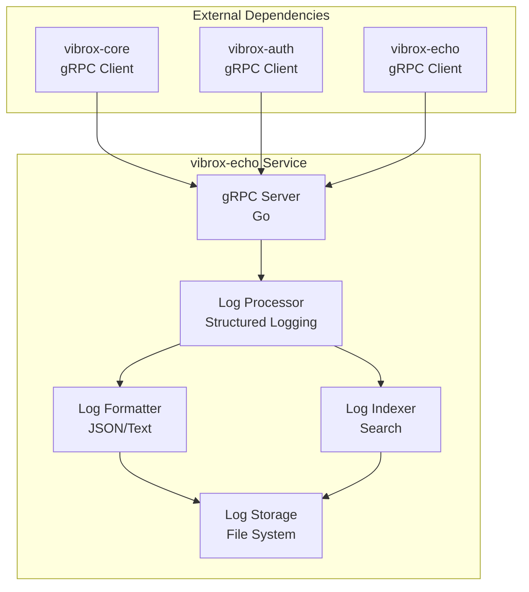
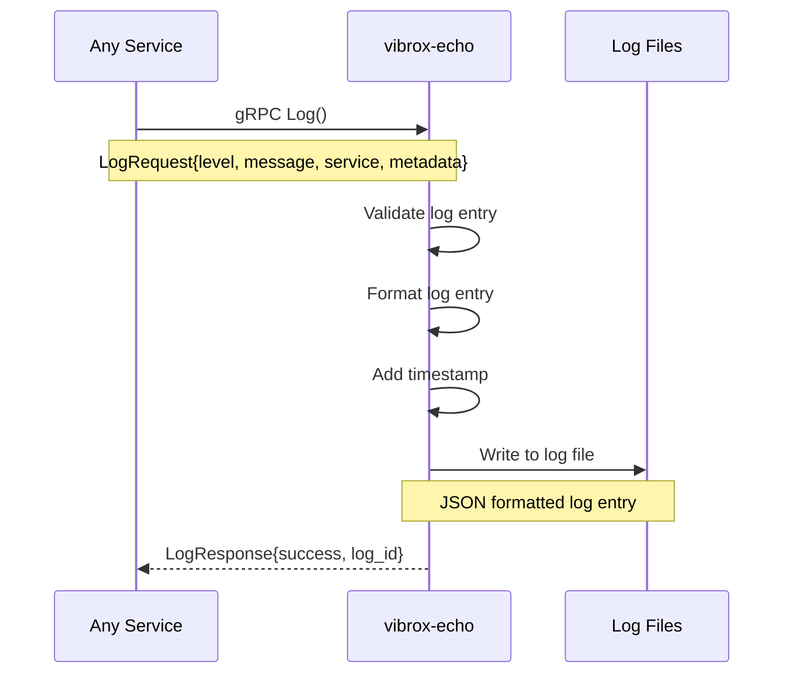
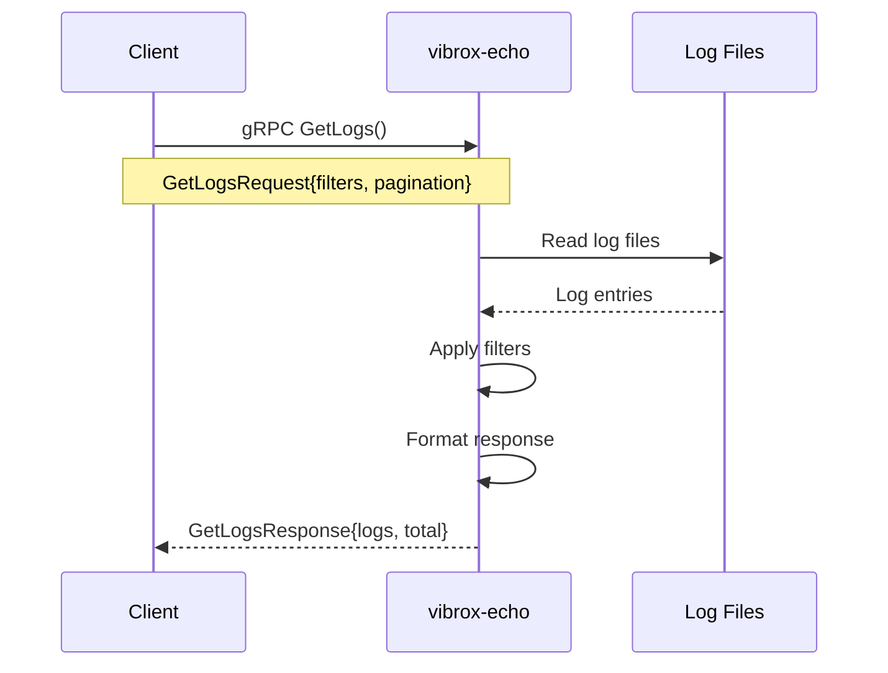

# vibrox-echo Service

The `vibrox-echo` service is the centralized logging component of the Vibrox Stack. Built with Go and gRPC, it provides structured logging, log aggregation, and log retrieval capabilities for all services in the system.

## 🎯 Overview

- **Technology**: Go with gRPC
- **Purpose**: Centralized logging and monitoring
- **Port**: 9000 (gRPC)
- **Repository**: [vibrox-echo](https://github.com/VibuRoshin25/vibrox-echo)

## 🏗️ Architecture



## 🔧 Configuration

### Environment Variables

| Variable        | Description             | Default   | Required |
| --------------- | ----------------------- | --------- | -------- |
| `LOG_LEVEL`     | Logging level           | `INFO`    | No       |
| `LOG_PATH`      | Log file path           | `./logs`  | No       |
| `LOG_FORMAT`    | Log format (json/text)  | `json`    | No       |
| `LOG_MAX_SIZE`  | Max log file size (MB)  | `100`     | No       |
| `LOG_MAX_FILES` | Max number of log files | `10`      | No       |
| `PORT`          | Service port            | `9000`    | No       |
| `HOST`          | Service host            | `0.0.0.0` | No       |

### Docker Configuration

```yaml
logger:
  build: ./vibrox-echo
  ports:
    - "9000:9000"
  environment:
    - LOG_LEVEL=INFO
    - LOG_PATH=/app/logs
    - LOG_FORMAT=json
    - LOG_MAX_SIZE=100
    - LOG_MAX_FILES=10
  volumes:
    - ./vibrox-echo/logs:/app/logs
  networks:
    - app-network
```

## 📡 gRPC API

### Logging Service

```protobuf
service LogService {
  // Log a message
  rpc Log(LogRequest) returns (LogResponse);

  // Get logs with filters
  rpc GetLogs(GetLogsRequest) returns (GetLogsResponse);

  // Search logs
  rpc SearchLogs(SearchLogsRequest) returns (SearchLogsResponse);

  // Get log statistics
  rpc GetLogStats(LogStatsRequest) returns (LogStatsResponse);

  // Stream logs in real-time
  rpc StreamLogs(StreamLogsRequest) returns (stream LogEntry);
}
```

### Message Definitions

```protobuf
// Log request
message LogRequest {
  string level = 1;           // DEBUG, INFO, WARN, ERROR, FATAL
  string message = 2;         // Log message
  string service = 3;         // Service name
  int32 user_id = 4;          // User ID (optional)
  string request_id = 5;      // Request ID (optional)
  map<string, string> metadata = 6;  // Additional metadata
}

// Log response
message LogResponse {
  bool success = 1;
  string log_id = 2;
  string error = 3;
}

// Get logs request
message GetLogsRequest {
  string service = 1;         // Filter by service
  string level = 2;           // Filter by level
  int32 user_id = 3;          // Filter by user ID
  string start_time = 4;      // Start time (ISO 8601)
  string end_time = 5;        // End time (ISO 8601)
  int32 limit = 6;            // Max number of logs
  int32 offset = 7;           // Offset for pagination
}

// Get logs response
message GetLogsResponse {
  repeated LogEntry logs = 1;
  int32 total = 2;
  string error = 3;
}

// Log entry
message LogEntry {
  string id = 1;
  string timestamp = 2;
  string level = 3;
  string message = 4;
  string service = 5;
  int32 user_id = 6;
  string request_id = 7;
  map<string, string> metadata = 8;
}
```

## 📝 Logging Standards

### Log Levels

| Level     | Description                    | Use Case                        |
| --------- | ------------------------------ | ------------------------------- |
| **DEBUG** | Detailed debugging information | Development and troubleshooting |
| **INFO**  | General information messages   | Normal application flow         |
| **WARN**  | Warning messages               | Potential issues                |
| **ERROR** | Error conditions               | Application errors              |
| **FATAL** | Fatal errors                   | Service termination             |

### Log Format

#### JSON Format (Default)

```json
{
  "timestamp": "2024-01-15T10:30:00.123Z",
  "level": "INFO",
  "service": "vibrox-core",
  "message": "User authenticated successfully",
  "user_id": 123,
  "request_id": "req-abc-123",
  "metadata": {
    "ip_address": "192.168.1.100",
    "user_agent": "Mozilla/5.0...",
    "endpoint": "/api/auth/login",
    "response_time": "45ms"
  }
}
```

#### Text Format

```
2024-01-15T10:30:00.123Z [INFO] vibrox-core: User authenticated successfully user_id=123 request_id=req-abc-123 ip_address=192.168.1.100
```

## 🔄 Logging Flow

### 1. Log Ingestion



### 2. Log Retrieval



## 🗄️ Storage Strategy

### File Organization

```
logs/
├── 2024/
│   ├── 01/
│   │   ├── 15/
│   │   │   ├── vibrox-core.log
│   │   │   ├── vibrox-auth.log
│   │   │   └── vibrox-echo.log
│   │   └── 16/
│   │       ├── vibrox-core.log
│   │       ├── vibrox-auth.log
│   │       └── vibrox-echo.log
│   └── 02/
└── 2023/
    └── 12/
```

### Log Rotation

```go
// Log rotation configuration
type LogConfig struct {
    MaxSize    int    // Maximum size in megabytes
    MaxFiles   int    // Maximum number of files to keep
    MaxAge     int    // Maximum age in days
    Compress   bool   // Whether to compress old files
    LocalTime  bool   // Use local time for timestamps
}
```

## 📊 Monitoring and Observability

### Health Check

```go
// Health check endpoint
func (s *LogService) HealthCheck(ctx context.Context, req *pb.HealthRequest) (*pb.HealthResponse, error) {
    return &pb.HealthResponse{
        Status:    "healthy",
        Service:   "vibrox-echo",
        Timestamp: time.Now().Format(time.RFC3339),
        Uptime:    time.Since(startTime).String(),
    }, nil
}
```

### Metrics Collection

```go
// Prometheus metrics
var (
    logRequestsTotal = prometheus.NewCounterVec(
        prometheus.CounterOpts{
            Name: "log_requests_total",
            Help: "Total number of log requests",
        },
        []string{"level", "service"},
    )

    logProcessingDuration = prometheus.NewHistogramVec(
        prometheus.HistogramOpts{
            Name:    "log_processing_duration_seconds",
            Help:    "Time spent processing log requests",
            Buckets: prometheus.DefBuckets,
        },
        []string{"level"},
    )
)
```

### Structured Logging

```go
// Structured logging with fields
logger := log.With(
    "service", "vibrox-echo",
    "version", "1.0.0",
    "environment", os.Getenv("NODE_ENV"),
)

logger.Info("Service started",
    "port", port,
    "log_level", logLevel,
    "log_path", logPath,
)
```

## 🧪 Testing

### Unit Tests

```go
// log_service_test.go
func TestLogService_Log(t *testing.T) {
    // Setup
    service := NewLogService()

    // Test case
    req := &pb.LogRequest{
        Level:   "INFO",
        Message: "Test log message",
        Service: "test-service",
    }

    resp, err := service.Log(context.Background(), req)

    // Assertions
    assert.NoError(t, err)
    assert.True(t, resp.Success)
    assert.NotEmpty(t, resp.LogId)
}
```

### Integration Tests

```go
// integration_test.go
func TestLogServiceIntegration(t *testing.T) {
    // Start server
    server := startTestServer(t)
    defer server.Stop()

    // Create client
    client := createTestClient(t)

    // Test log ingestion
    req := &pb.LogRequest{
        Level:   "INFO",
        Message: "Integration test message",
        Service: "test-service",
    }

    resp, err := client.Log(context.Background(), req)
    assert.NoError(t, err)
    assert.True(t, resp.Success)

    // Test log retrieval
    getReq := &pb.GetLogsRequest{
        Service: "test-service",
        Limit:   10,
    }

    getResp, err := client.GetLogs(context.Background(), getReq)
    assert.NoError(t, err)
    assert.Len(t, getResp.Logs, 1)
}
```

## 🚀 Performance Optimization

### Buffered Writing

```go
// Buffered log writer
type BufferedLogWriter struct {
    buffer    chan LogEntry
    writer    io.Writer
    batchSize int
    flushInterval time.Duration
}

func (w *BufferedLogWriter) Write(entry LogEntry) error {
    select {
    case w.buffer <- entry:
        return nil
    default:
        // Buffer full, flush immediately
        return w.flush()
    }
}
```

### Compression

```go
// Gzip compression for old logs
func compressLogFile(filename string) error {
    file, err := os.Open(filename)
    if err != nil {
        return err
    }
    defer file.Close()

    gzFile, err := os.Create(filename + ".gz")
    if err != nil {
        return err
    }
    defer gzFile.Close()

    gzWriter := gzip.NewWriter(gzFile)
    defer gzWriter.Close()

    _, err = io.Copy(gzWriter, file)
    return err
}
```

### Indexing

```go
// Simple in-memory index for fast searches
type LogIndex struct {
    byService map[string][]string
    byLevel   map[string][]string
    byUser    map[int32][]string
    mutex     sync.RWMutex
}

func (idx *LogIndex) Add(entry LogEntry) {
    idx.mutex.Lock()
    defer idx.mutex.Unlock()

    // Add to service index
    idx.byService[entry.Service] = append(idx.byService[entry.Service], entry.ID)

    // Add to level index
    idx.byLevel[entry.Level] = append(idx.byLevel[entry.Level], entry.ID)

    // Add to user index
    if entry.UserId > 0 {
        idx.byUser[entry.UserId] = append(idx.byUser[entry.UserId], entry.ID)
    }
}
```

## 🔧 Development Setup

### Local Development

```bash
# Clone the repository
git clone https://github.com/VibuRoshin25/vibrox-echo.git
cd vibrox-echo

# Install dependencies
go mod download

# Set environment variables
export LOG_LEVEL=DEBUG
export LOG_PATH=./logs
export LOG_FORMAT=json

# Run the service
go run main.go

# Run tests
go test ./...
```

### Docker Development

```bash
# Build and run with Docker
docker build -t vibrox-echo .
docker run -p 9000:9000 -v $(pwd)/logs:/app/logs vibrox-echo

# Or use Docker Compose
docker-compose up logger
```

## 📈 Scaling Considerations

### Horizontal Scaling

```yaml
# Kubernetes deployment with multiple replicas
apiVersion: apps/v1
kind: Deployment
metadata:
  name: vibrox-echo
spec:
  replicas: 3
  selector:
    matchLabels:
      app: vibrox-echo
  template:
    spec:
      containers:
        - name: vibrox-echo
          image: vibrox-echo:latest
          ports:
            - containerPort: 9000
          volumeMounts:
            - name: log-storage
              mountPath: /app/logs
      volumes:
        - name: log-storage
          persistentVolumeClaim:
            claimName: log-pvc
```

### Load Balancing

```yaml
# Kubernetes service for load balancing
apiVersion: v1
kind: Service
metadata:
  name: vibrox-echo-service
spec:
  selector:
    app: vibrox-echo
  ports:
    - port: 9000
      targetPort: 9000
  type: ClusterIP
```

## 🔍 Troubleshooting

### Common Issues

#### 1. Disk Space Issues

```bash
# Check disk usage
df -h

# Check log directory size
du -sh ./logs

# Clean up old logs
find ./logs -name "*.log" -mtime +30 -delete
find ./logs -name "*.gz" -mtime +90 -delete
```

#### 2. Performance Issues

```bash
# Check log file sizes
ls -lh ./logs/*.log

# Monitor log ingestion rate
tail -f ./logs/vibrox-echo.log | grep "log_requests_total"

# Check memory usage
ps aux | grep vibrox-echo
```

#### 3. gRPC Connection Issues

```bash
# Test gRPC connectivity
grpcurl -plaintext localhost:9000 list

# Check gRPC health
grpcurl -plaintext localhost:9000 grpc.health.v1.Health/Check

# Test log endpoint
grpcurl -plaintext -d '{"level":"INFO","message":"test","service":"test"}' localhost:9000 LogService/Log
```

### Debug Mode

```go
// Enable debug logging
os.Setenv("LOG_LEVEL", "DEBUG")

// Add debug statements
log.Debug("Processing log request",
    "level", req.Level,
    "service", req.Service,
    "message_length", len(req.Message),
)
```

## 🔗 Integration Examples

### Go Client Integration

```go
package main

import (
    "context"
    "log"
    "google.golang.org/grpc"
    pb "path/to/log/proto"
)

func main() {
    conn, err := grpc.Dial("localhost:9000", grpc.WithInsecure())
    if err != nil {
        log.Fatal(err)
    }
    defer conn.Close()

    client := pb.NewLogServiceClient(conn)

    // Log a message
    resp, err := client.Log(context.Background(), &pb.LogRequest{
        Level:   "INFO",
        Message: "Application started",
        Service: "my-service",
        Metadata: map[string]string{
            "version": "1.0.0",
            "environment": "production",
        },
    })

    if err != nil {
        log.Fatal(err)
    }

    log.Printf("Log ID: %s", resp.LogId)
}
```

### Node.js Client Integration

```javascript
const { LogServiceClient } = require("./log_grpc_pb");
const { LogRequest } = require("./log_pb");

const client = new LogServiceClient("localhost:9000");

async function logMessage(level, message, service, metadata = {}) {
  const request = new LogRequest();
  request.setLevel(level);
  request.setMessage(message);
  request.setService(service);

  // Add metadata
  Object.entries(metadata).forEach(([key, value]) => {
    request.getMetadataMap().set(key, value);
  });

  try {
    const response = await client.log(request);
    return {
      success: response.getSuccess(),
      logId: response.getLogId(),
    };
  } catch (error) {
    console.error("Logging failed:", error);
    throw error;
  }
}

// Usage
logMessage("INFO", "User logged in", "auth-service", {
  userId: "123",
  ipAddress: "192.168.1.100",
});
```

## 📊 Log Analytics

### Log Statistics

```go
// Log statistics endpoint
func (s *LogService) GetLogStats(ctx context.Context, req *pb.LogStatsRequest) (*pb.LogStatsResponse, error) {
    stats := &pb.LogStatsResponse{
        TotalLogs:     getTotalLogs(),
        LogsByLevel:   getLogsByLevel(),
        LogsByService: getLogsByService(),
        LogsByHour:    getLogsByHour(),
    }

    return stats, nil
}
```

### Log Search

```go
// Full-text search implementation
func (s *LogService) SearchLogs(ctx context.Context, req *pb.SearchLogsRequest) (*pb.SearchLogsResponse, error) {
    query := req.GetQuery()
    results := searchLogFiles(query, req.GetFilters())

    return &pb.SearchLogsResponse{
        Logs:  results,
        Total: int32(len(results)),
    }, nil
}
```

---

_This service documentation should be updated when significant changes are made to the logging service. Use `/adr` to create Architecture Decision Records for major logging decisions._
